# CATIA Modeling  

This page showcases a variety of computer-aided design (CAD) models & assemblies created throughout my academic career using advanced 3D modeling techniques in CATIA.  

With emphasis on organizational structure & efficient, adaptable models, the following parts & assemblies utilize parametric modeling, wireframe design, and generative surface design to emulate proper modeling hygiene used in the aerospace industry.

***Page Contents***
- *Projects*
  - Full Lawn Mower Design & Assembly
  - CubeSat Assembly
  - Skateboard Assembly
- *Radial Engine Kinematics*
- *Complex Surfacing*
- *Advanced Part Design*
---

## Projects

The part models & assemblies included in this section display large-scale projects that I've worked on in collaboration with peers.

### Full Lawn Mower Design & Assembly 

The objective of this project was to select a complex machine to disassemble down to every nut & bolt, divide parts amongst five team members, and replicate each part & subassembly as accurately as possible.

Our team decided to model a Craftsman rotary push mower containing a 4-stroke engine. The full assembly, as well as my individual contributions, are displayed below with side-by-side comparisons to demonstrate our attention to detail throughout the modeling process.

  
  

    
    
<em>Crafstman push mower</em>

  

  

    
    
<em>Completed lawn mower assembly designed in CATIA</em>

  

Displayed below are all the parts from the completed assembly that I designed individually. To avoid clutter, I've included only the part models that use advanced design criteria such as surfacing, wireframe design, and tracer/curvature overlay design.

The primary workbenches used to model each component included the part design, generative surfacing, and assembly design workbenches.

    
    
<em>My individually design parts/assemblies</em>

  
  

    
    
<em>Fuel tank casing</em>

  

  

    
    
<em>Fuel tank casing CATIA model</em>

  

  
  

    
    
<em>Top engine cover</em>

  

  

    
    
<em>Top engine cover CATIA model</em>

  

  
  

    
    
<em>Engine flywheel</em>

  

  

    
    
<em>Engine flywheel CATIA model</em>

  

  
  

    
    
<em>Drive control cable</em>

  

  

    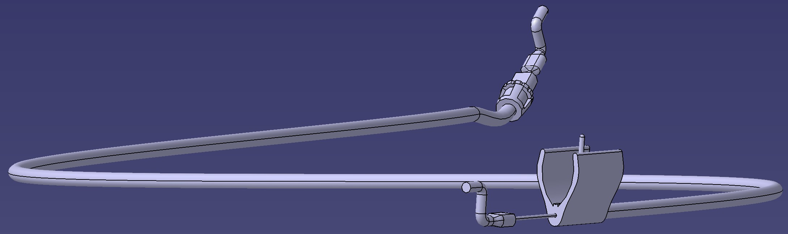
    
<em>Drive control cable CATIA model</em>

  

  
  

    
    
<em>Drive mechanism cover</em>

  

  

    
    
<em>Drive mechanism cover CATIA model</em>

  

  
  

    
    
<em>Mower brake</em>

  

  

    
    
<em>Mower brake CATIA model</em>

  

  
  

    
    
<em>Discharge guard</em>

  

  

    
    
<em>Discharge guard CATIA model</em>

  

  
  

    
    
<em>Armature magneto</em>

  

  

    
    
<em>Armature magneto CATIA model</em>

  

  
  

    
    
<em>Pull chord rope guide</em>

  

  

    
    
<em>Pull chord rope guide CATIA model</em>

  

---

### CubeSat Senior Design Assembly

Part of my capstone project has involved creating a 3D model of our team's 3U CubeSat, including each selected component & subsystem. Displayed below are several views that highlight the spacecraft in stowed & deployed configurations.

Each component model labeled in the internal view was obtained directly from vendor sites to ensure integration feasibility within the 3U spacecraft architecture.

  
  

    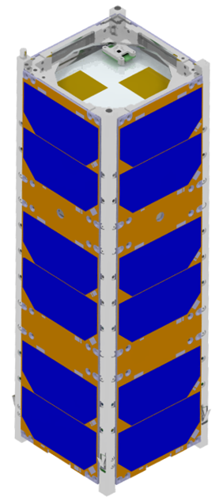
    
<em>3U CubeSat in stowed configuration to meet deployer requirements</em>

  

  

    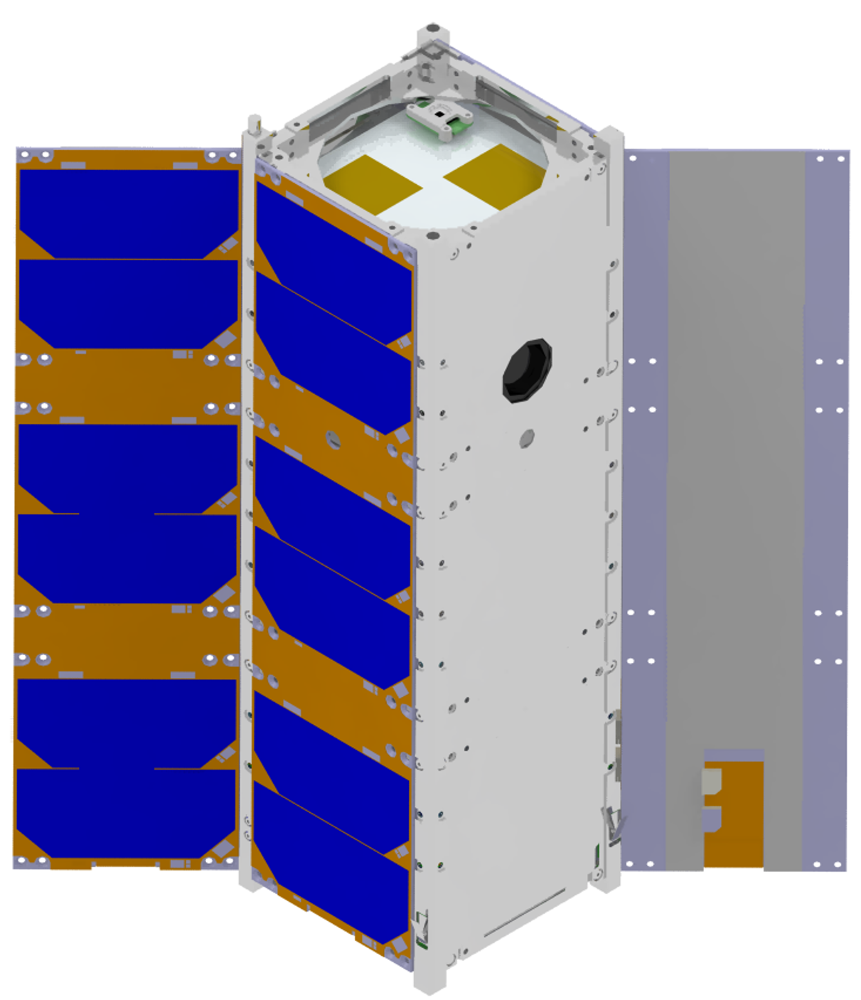
    
<em>Deployed CubeSat configuration to conduct mission operations</em>

  

    
    
<em>Internal component view highlighting vendor-acquired part models</em>

If you are interested in reading more about the CubeSat's mission objectives or the analysis that led to this design, check out the CubeSat Senior Design project page, which provides in-depth breakdowns of our design decisions throughout the project.

---

### Intro to 3D Modeling & CAD Project

The assembly displayed below is the final product of a design project I completed as a freshman at ERAU. In an individual design project, I disassembled, designed, and assembled each component making up a skateboard.

    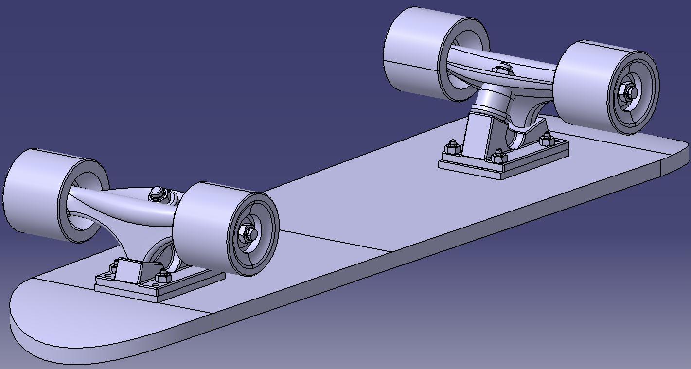
    
<em>My individually design parts/assemblies</em>

---

## Radial Engine Kinematics 

As I've progressed in my advanced 3D-CADD & Engineering Documentation course, I've modeled each part in the radial engine assembly shown below. Week by week, I applied new skills to add complexity to the design, finishing with the animated kinematics demonstration seen below.
<video width="700" autoplay loop muted playsinline>
  <source src="/assets/radial_engine.mp4" type="video/mp4">
</video>

---

## Complex Surfacing

Each model in the following section utilizes the generative shape design workbench with parameterized, adaptable part models. This workbench allows for complex geometries & curvature to be modeled efficiently with high modularity.
<video width="700" autoplay loop muted playsinline>
  <source src="/assets/phantom_chair.mp4" type="video/mp4">
</video>

<video width="700" autoplay loop muted playsinline>
  <source src="/assets/mouse.mp4" type="video/mp4">
</video>

    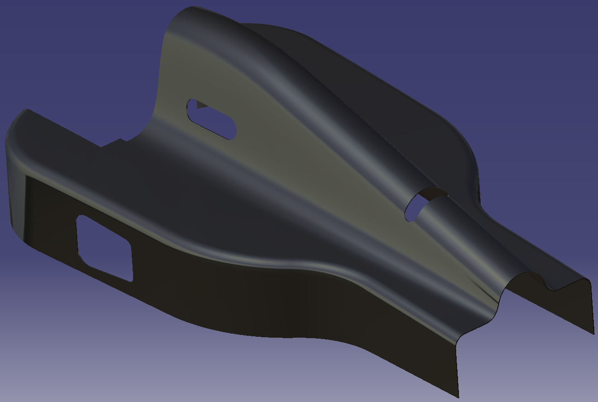
    
<em>Formula 1 vehicle fairing</em>

  
  

    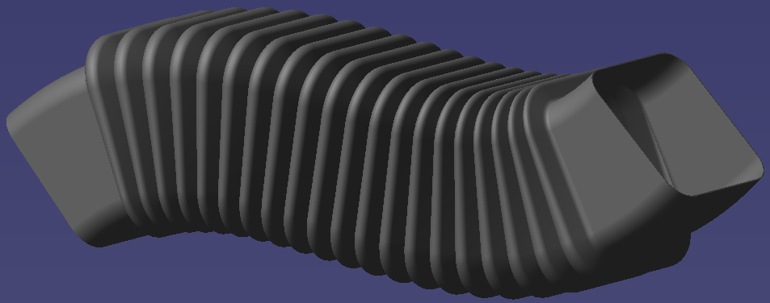
    
<em>Adaptive surface designed duct with curved spine geometry</em>

  

  

    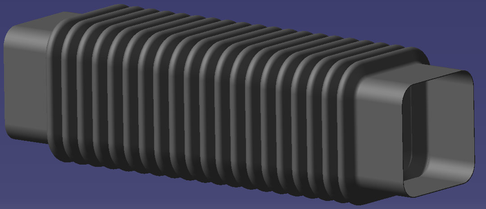
    
<em>Straight spine configuration</em>

  

    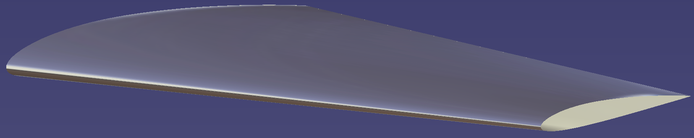
    
<em>Parametrically designed NACA airfoil</em>

    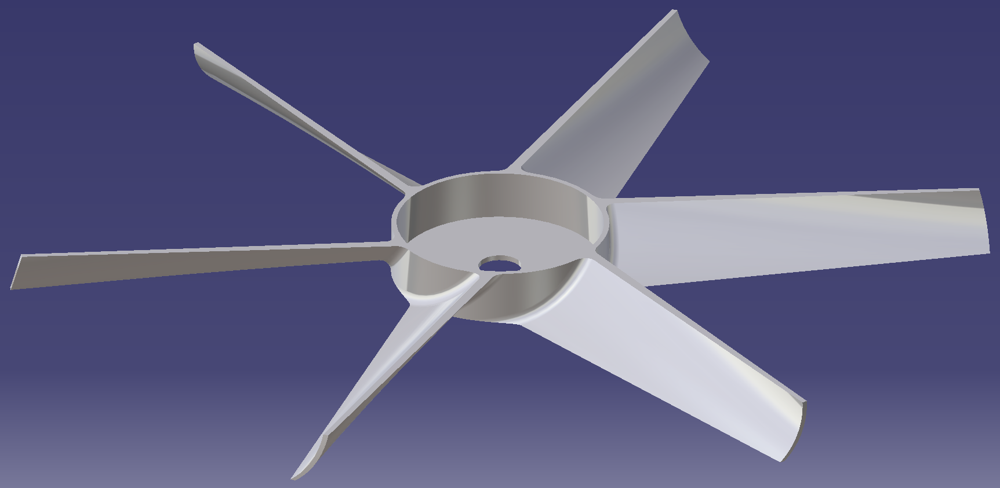
    
<em>Surface-based parametric ceiling fan</em>

  
  

    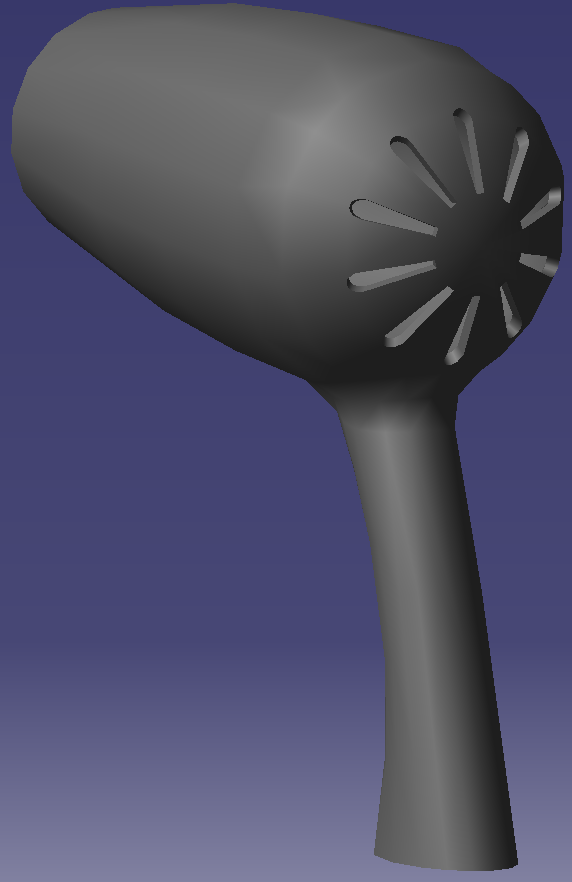
    
<em>Hairdryer surfacing model</em>

  

  

    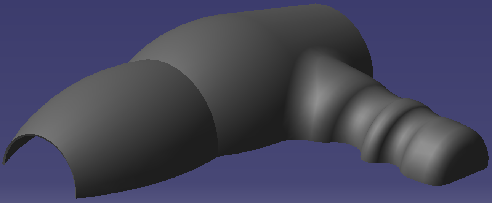
    
<em>Geometrically complex curved hairdryer</em>

  

    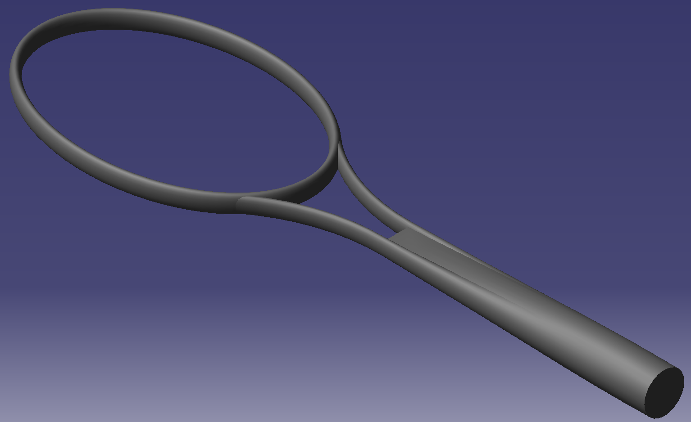
    
<em>Surface-based tennis racket structure</em>

---

## Advanced Part Models  

This section contains CATIA models created in the part design workbench that are commonly used in engineering applications. Modeling techniques such as wireframe design, multi-section solids, and parameterization were employed throughout.

    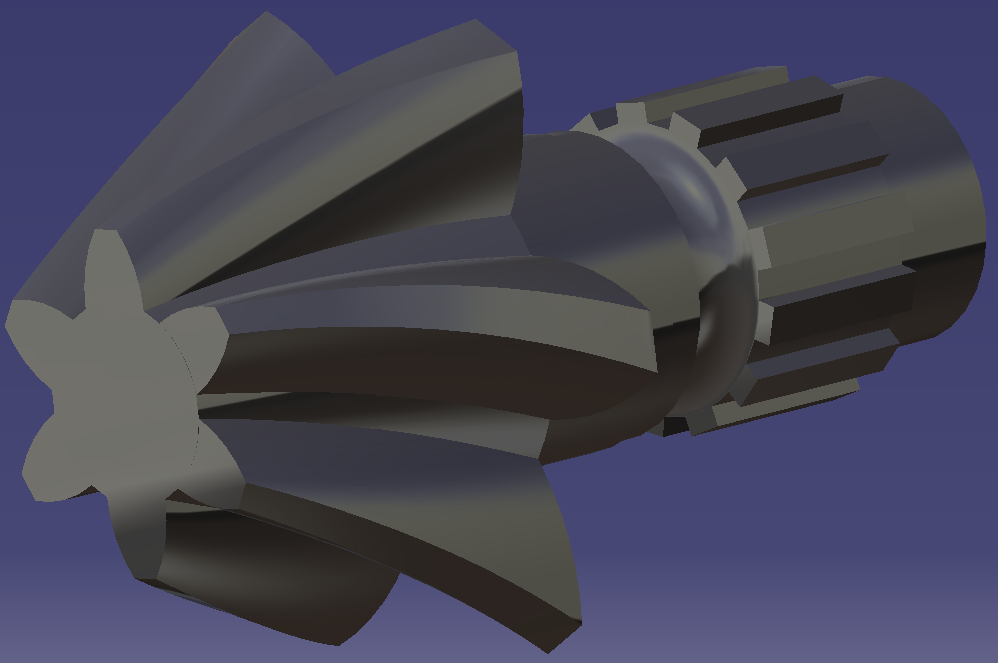
    
<em>Helical bevel gear</em>

    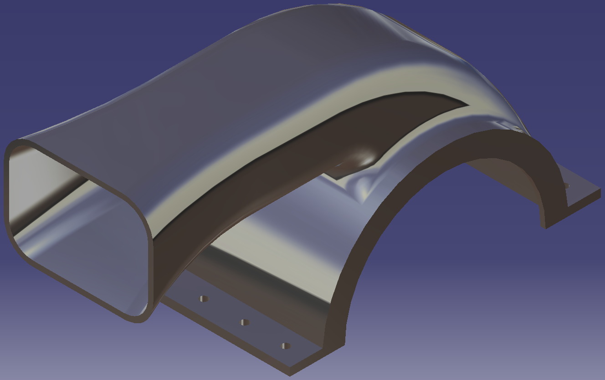
    
<em>Blower exhaust housing</em>

    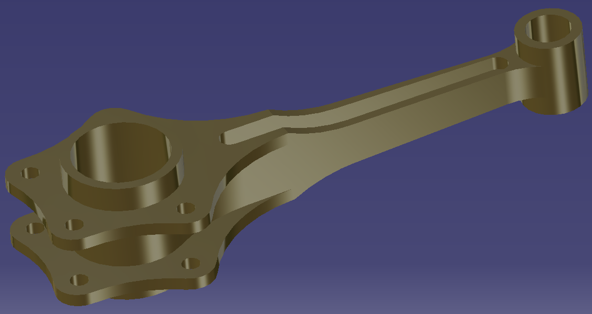
    
<em>Radial engine master rod</em>

  
  

    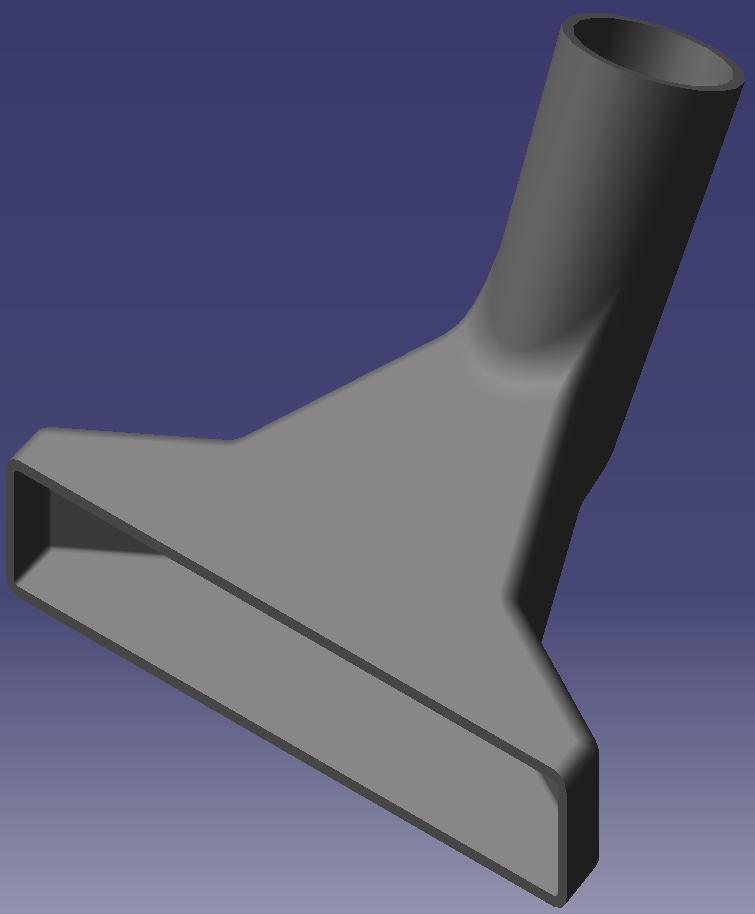
    
<em>Vacuum head attachment with parameters</em>

  

  

    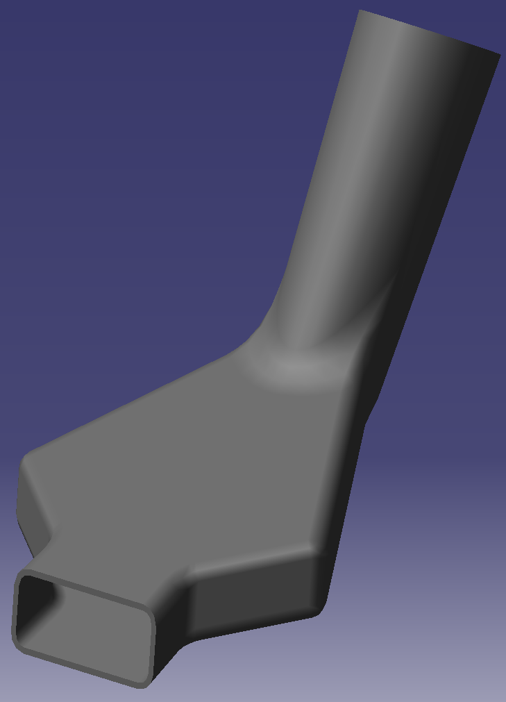
    
<em>Vacuum head attachment with adjusted parameters</em>

  

