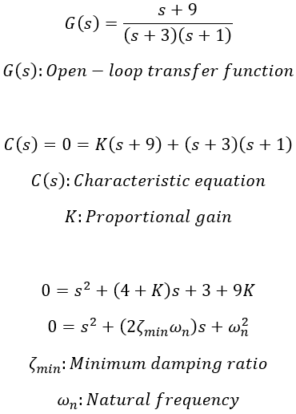
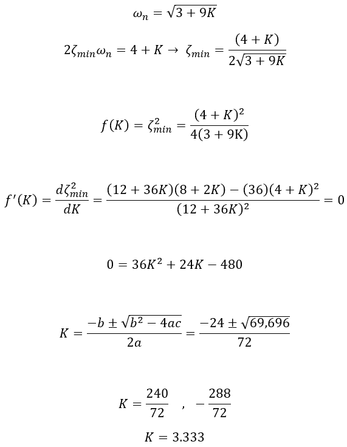
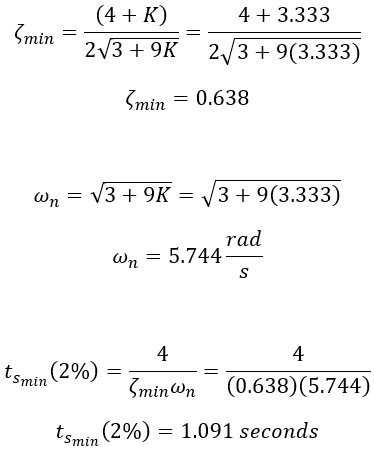
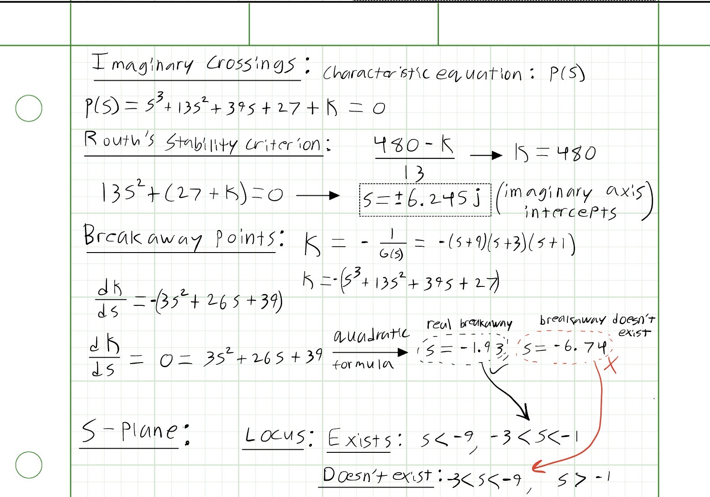
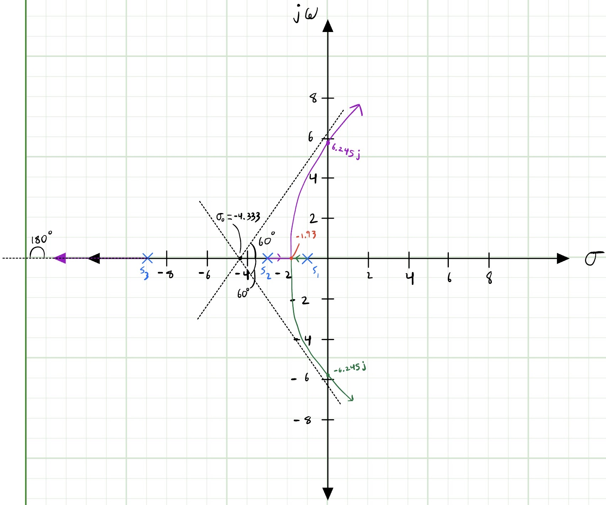
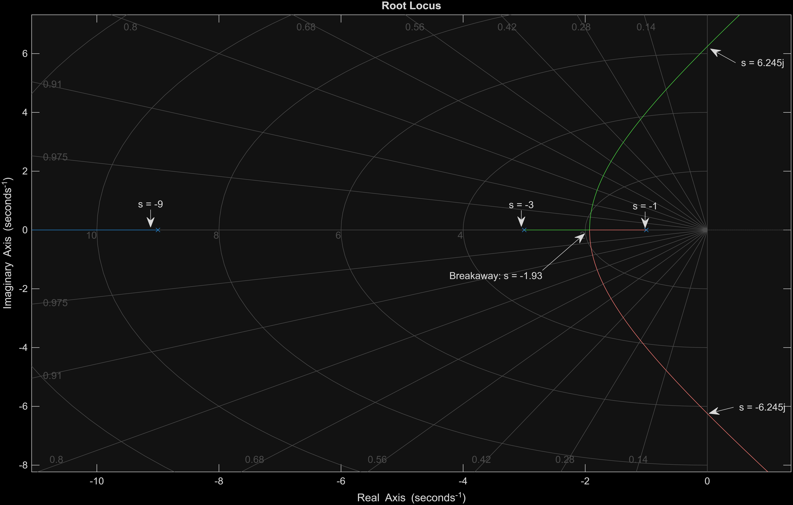
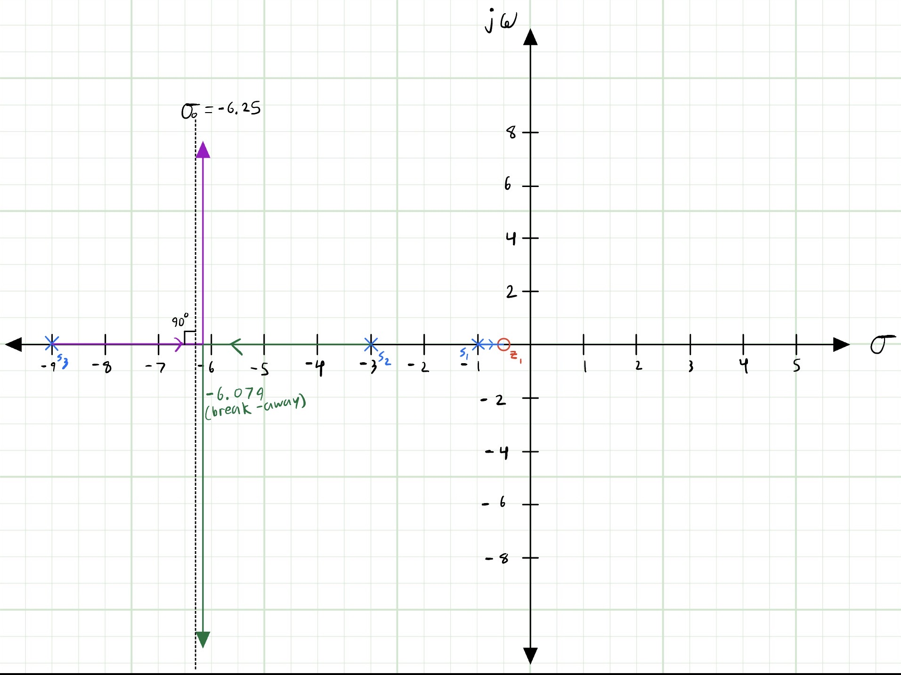
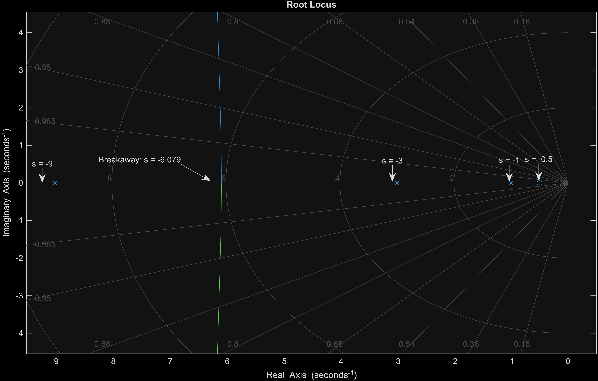

**Role:** Project Lead  
**Institution:** Embry-Riddle Aeronautical University  
**Course:** Spacecraft Control (AE 434)  
**Dates:** October 2025 - December 2025  
**Tools:** MATLAB

---

## Project Overview

During my spacecraft control course, I led a group of three students in an analytical research project investigating stability characteristics of second-order feedback control systems. The objective of the project was to apply classical control theory to analyze design methods commonly used for spacecraft guidance, navigation, and control systems.

Using a combination of MATLAB transfer function modeling, root locus analysis, and classical control methods, we examined how variations in key control parameters affect system performance metrics. By tuning proportional gain, damping ratio, and undamped natural frequency, we observed the resulting effect on settling time, percent overshoot, and closed-loop pole location.

These stability metrics are critical in spacecraft attitude control systems. Operating in hostile environments with an abundance of disturbances, feedback control systems must respond quickly with minimal oscillations to reduce pointing error for sensors & communication hardware.

The stability analysis concepts explored in this project were not part of the formal course curriculum, which provided our team with an opportunity to conduct independent research & develop technical communication skills. The culmination of our efforts was documented in a detailed technical report provided below:

### [Control Systems Stability Analysis Report (PDF)](assets/control_project.pdf)

---

## My Responsibilities

The project consisted of two primary tasks involving analytical stability analysis & root locus modeling.

### Task 1 (Closed-Loop Pole Analysis)

The first task focused on analyzing a given open-loop transfer function (OLTF) to determine the positive gain value that produced the minimum damping ratio in the closed-loop system. From this condition, I obtained the 2% settling time, an important metric describing how quickly the system reaches steady-state after a disturbance.

As the project lead, I performed the analytical derivation required to solve for the optimal gain & associated system parameters.

Provided below is a walkthrough of the methods I used to calculate the system's response parameters:

    
    
<em>Open-loop transfer function & resulting characteristic equation</em>

The OLTF G(s) contained an open-loop zero & three poles located on the negative real axis at s = -1, -3, -9. It's important to note that all the poles lie in the left half of the complex plane & each term in the characteristic equation C(s) shares the same sign (+). These system characteristics indicate stability at first glance.

To obtain expressions for undamped natural frequency & damping ratio in terms of proportional gain K, I compared the derived characteristic equation to the standard form of a second-order system. Matching coefficients between the two equations allowed the system parameters to be expressed solely as functions of gain.

    
    
<em>Coefficient matching & proportional gain solution</em>

To determine the gain value associated with the minimum damping ratio, I defined a function f(K) & set its derivative equal to zero to identify the extrema. Solving the resulting quadratic equation yielded two potential gain values; however, the negative solution can be neglected because the system specification required positive proportional gain.

Substituting the optimal gain value K = 3.333 into the previously derived expressions produced the system's minimum damping ratio & undamped natural frequency.

    
    
<em>Derived damping parameters & transient response metrics</em>

Using these parameters, I calculated the system's percent overshoot & 2% settling time, providing insight into how quickly & smoothly the control system responds to disturbances.

Applying these performance metrics to real spacecraft systems directly influences attitude pointing performance. Any satellite performing surface imaging must minimize overshoot & oscillations to ensure cameras remain accurately pointed at their target.

### Task 2 (Root Locus Behavior)

The second task investigated the root locus behavior of two open-loop transfer functions with identical closed-loop pole locations. The key difference between the systems was the presence of an open-loop zero in the second transfer function.

For each system, I calculated the following graphical characteristics to draw the root locus by hand:

- Root locus for positive gain
- Asymptote angles
- Asymptote centroid on the real axis
- Breakaway points
- Imaginary-axis intercepts

These parameters define how the closed-loop poles move in the complex plane as gain varies; a fundamental concept for tuning control systems.

My derivations for each parameter are shown below.

  
  

    
    
<em></em>

  

  

    
    
<em></em>

  

Using these parameters, I constructed a hand-drawn root locus plot for the first system.

    
    
<em>Root locus plot for system 1</em>

To verify my analytical results, I developed a MATLAB script defining the transfer function and used the built-in "rlocus()" function to generate the corresponding plot.

    
    
<em>MATLAB root locus verification for system 1</em>

The close agreement between the analytical plot & MATLAB output validated the accuracy of my calculations & demonstrates how classical control theory can be used to accurately predict closed-loop stability behavior. An important note for this system is the imaginary-axis intercepts. Their presence indicates instability in the system for large gain values.

The second system introduced an open-loop zero at s = -0.5, significantly altering the root locus trajectory & transient response characteristics.

    
    
<em>Root locus plot for system 2</em>

    
    
<em>MATLAB root locus verification for system 2</em>

Observing the difference between the systems highlights how open-loop pole/zero placement strongly influences system stability & transient response behavior. These are vital decisions to consider when designing spacecraft control systems, such as reaction wheel controllers or satellite pointing loops.

---

## Key Takeaways

This project was instrumental for  strengthening my understanding of classical control system design & stability analysis.

Through the analytical derivations in Task 1, I explored how proportional gain influences damping ratio, settling time, and transient response behavior in second-order systems.

Task 2 introduced me to the capabilities of root locus analysis as a graphical design tool, allowing engineers to visualize how closed-loop poles migrate as gain varies. This method is widely used when designing & tuning control systems for aerospace applications, including spacecraft attitude control, launch vehicle guidance, and aircraft autopilot systems.

Overall, the project reinforced the importance of combining analytical methods with computational tools such as MATLAB to efficiently analyze & validate control system performance.
