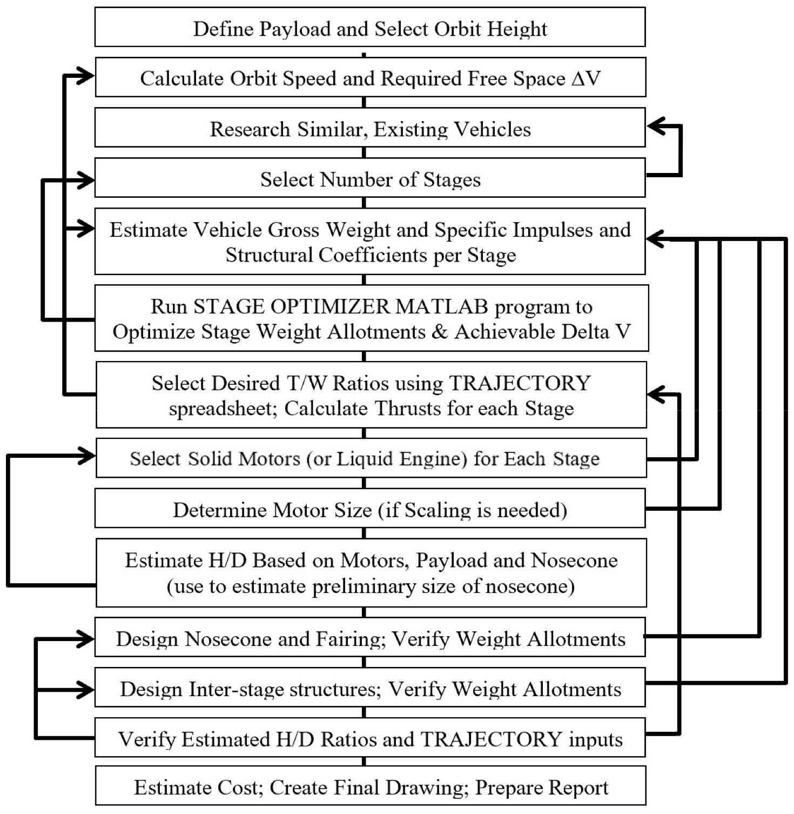
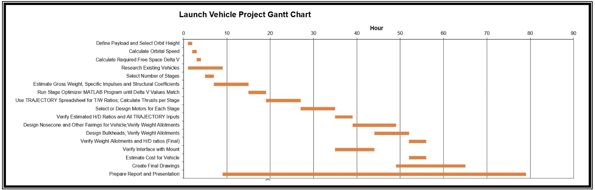
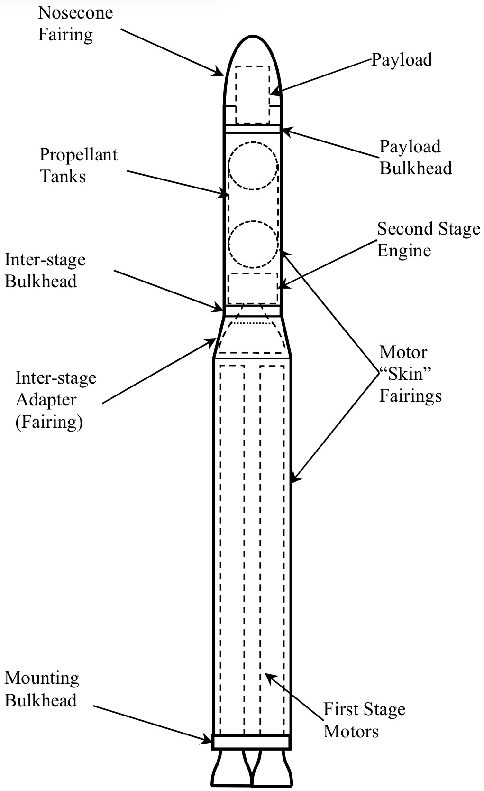
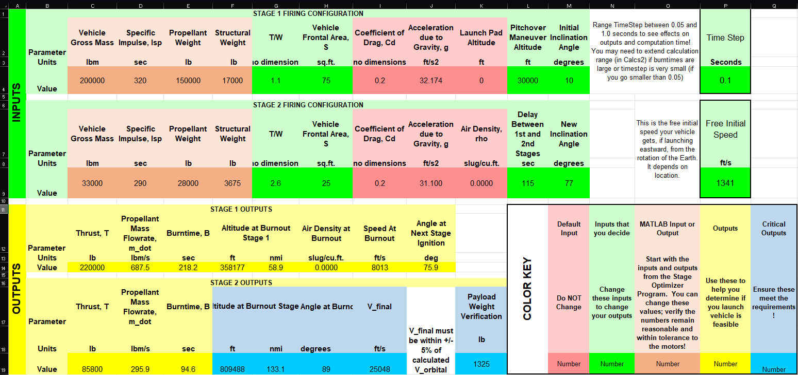
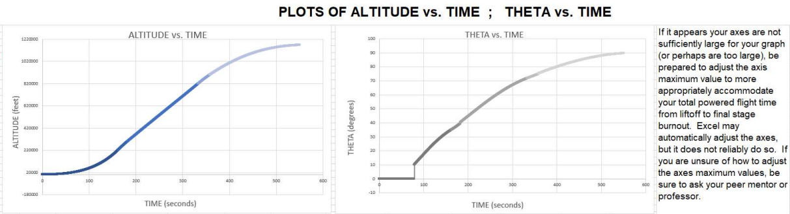
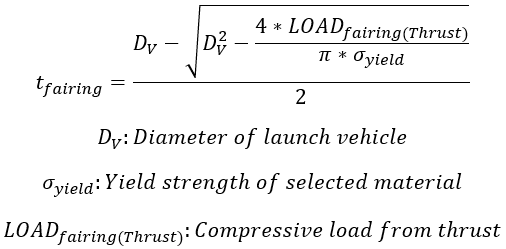
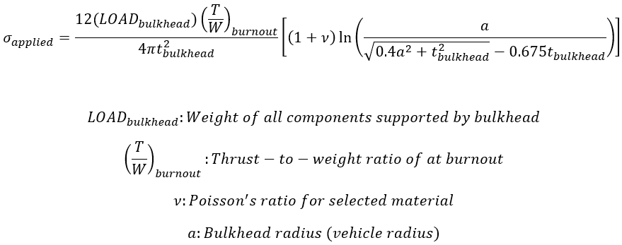
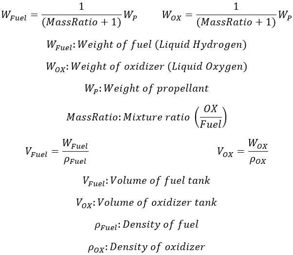
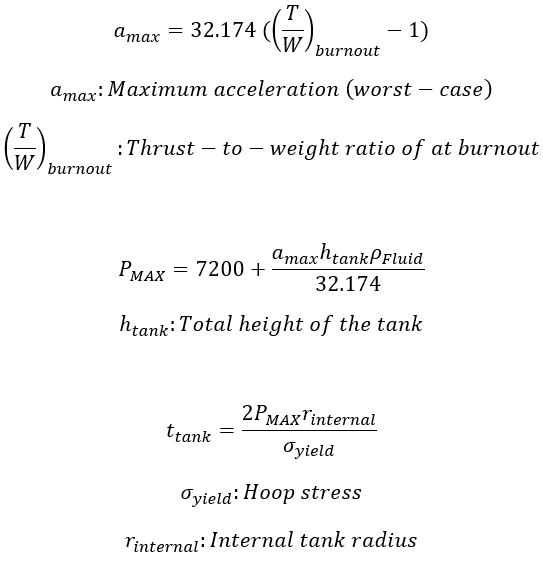
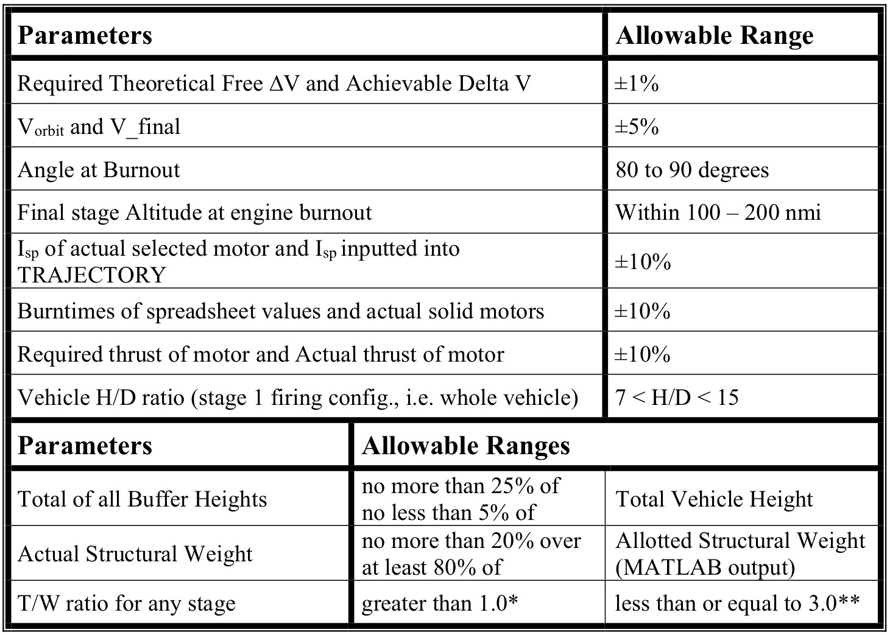

**Role:** Systems Integration Engineer  
**Institution:** Embry-Riddle Aeronautical University  
**Course:** Introduction to Engineering (EGR 101)  
**Dates:** January 2023 - February 2023  
**Tools:** MATLAB, CATIA, Microsoft Suite

---

## Project Overview

This project focused on the conceptual design & integration of a multi-stage, hybrid-fueled medium-lift launch vehicle capable of delivering a 4,750 lb reconnaissance satellite into Low Earth Orbit (LEO). Conducted during my freshman year, the project served as an introduction to aerospace systems engineering & the iterative design workflows used in real launch vehicle development programs.

Although the technical depth was intentionally limited compared to senior-level design projects, the assignment emphasized systems-level thinking, requiring our team to balance propulsion efficiency, structural feasibility, trajectory constraints, and payload requirements within a single integrated vehicle architecture.

The design process began with selecting an orbital altitude & calculating the total change in velocity (ΔV) required to reach orbit. From there, we developed a vehicle configuration capable of delivering that performance while satisfying constraints & propulsion limitations.

Throughout the project, we used iteration-based tools in MATLAB & Excel to optimize: 
- Mass distribution between stages
- Propellant utilization for maximum ΔV
- Launch trajectory characteristics
- Thrust-to-weight ratios for each stage

    
    
<em>Launch vehicle design workflow</em>

The flowchart above illustrates the iterative design process used throughout the project. Many stages of the workflow loop back to earlier steps, reflecting how real aerospace design programs continuously refine vehicle parameters as new constraints or performance limitations emerge.

Another key component of the project was maintaining a structured development timeline. The team followed a milestone-driven schedule similar to those used in professional engineering programs.

    
    
<em>Project schedule & milestone timeline</em>

---

## My Responsibilities
Our team consisted of four students, each responsible for a different subsystem of the launch vehicle. In my role as Systems Integration Engineer, I focused on vehicle configuration decisions & ensuring compatibility between propulsion systems, structural components, and stage interfaces.

My responsibilities included defining the vehicle architecture, verifying structural feasibility, and coordinating integration between solid rocket boosters, liquid propulsion components, and interstage structures.

---

### Vehicle Configuration

One of my primary responsibilities was defining the overall vehicle architecture & ensuring proper interfacing between stages.

    
    
<em>Final launch vehicle configuration</em>

The final configuration used solid rocket motors (SRMs) for the first stage to provide high initial thrust, followed by a liquid-propelled second stage to efficiently complete orbital insertion.

This hybrid approach reflects real-world launch vehicle design strategies, where solid propulsion provides high thrust for liftoff, while liquid propulsion enables precise control & higher efficiency during upper-stage burns.

Structural components such as fairings, bulkheads, and propellant tanks were sized using industry-standard factors of safety between 1.1 & 1.5 to ensure structural reliability under launch loads.

---

### Stage Optimization

To determine the optimal architecture, we began with a MATLAB stage optimization tool developed by previous students. The program calculated the most efficient distribution of structural & propellant mass across a specified number of stages.

Inputs for the stage-optimizer included:

- Number of stages (2 or 3)
- Desired specific impulse of each stage
- Total vehicle mass
- Payload mass
- Structural coefficients

Because several inputs depended on preliminary design assumptions, we researched existing launch vehicles with similar architectures & adjusted parameters until the optimized ΔV matched our calculated orbital requirement.

This type of iterative performance modeling is widely used in early-stage launch vehicle design, where engineers explore different configurations to determine the most efficient architecture to meet the necessary requirements.

---

### Trajectory Spreadsheet & Thrust/Weight Ratios

After establishing the optimal mass distribution between the stages, we used an Excel-based trajectory model to determine the thrust-to-weight ratios required to achieve the desired orbital velocity.

    
    
<em>Trajectory optimization spreadsheet</em>

    
    
<em>Trajectory plots showing altitude & flight path angle vs. time</em>

The trajectory model incorporated both known parameters from the stage optimizer & unknown design variables such as:

- Thrust-to-weight ratio
- Vehicle drag characteristics
- Pitch-over maneuver altitude

By iteratively adjusting these values, we were able to achieve a trajectory that met the required orbital velocity while maintaining realistic ascent dynamics. The final model produced several key launch parameters, including:

- Burnout altitude
- Burnout angle
- Final orbital velocity
- Required thrust for each stage
- Burn duration

Using these outputs, we selected flight-proven propulsion systems to meet the thrust requirements. The final configuration used scaled M-24 engines for the first stage & an RL-10A Centaur upper-stage engine.

---

### Structural Components

After determining the propulsion requirements, my primary responsibility shifted toward ensuring the structural feasibility of the launch vehicle architecture.

I calculated structural thickness, material selection, and total mass for the following components:

- Interstage bulkheads
- Motor fairings
- Interstage adapters
- Payload fairing
- Propellant tanks

All calculations  incorporated a factor of safety of 1.5.

---

#### Fairings

To determine the minimum fairing wall thickness, I analyzed compressive loading caused by thrust forces during ascent, which represented the primary structural stress.

    
    
<em>Fairing wall thickness equation</em>

Although I had not yet taken any formal structures or mechanics courses at the time, my professor provided the necessary equations to perform the analysis.

I evaluated several material options before selecting 6061-T6 aluminum, which offered an effective balance between yield strength & low density.

To ensure aerodynamic stability, the vehicle also had to meet height-to-diameter ratio constraints:

- Initial launch configuration:      7 < H/D < 15
- Upper stage configuration:         5 < H/D < 13

After evaluating several nosecone geometries, I selected an elliptical payload fairing due to its favorable aerodynamic properties.

---

#### Bulkheads

Bulkhead design focused on resisting bending stresses caused by the weight of the vehicle & thrust loads transmitted between stages.

    
    
<em>Bulkhead applied stress equation</em>

Because the equation could not be solved directly for thickness, I determined the required value through an iterative approach, tuning the thickness value until the calculated applied stress matched the yield stress of the selected material.

Due to the high structural loads carried by bulkheads, I selected stainless steel as the material.

Bulkhead thickness for each interstage structure decreases with altitude because vehicle mass & thrust loads diminish as propellant is consumed during ascent.

---

#### Propellant Tanks

The propellant tank design required determining both the volume & structural thickness needed to safely contain the liquid hydrogen & liquid oxygen used by the upper-stage engine.

    
    
<em>Fuel/Oxidizer weight & tank volume equations</em>

Using the RL-10A engine mixture ratio of 5:1 oxidizer to  fuel, I calculated the required propellant masses & corresponding tank volumes.

To determine tank thickness, the design had to account for the maximum internal pressure during launch. Launch considerations that contribute to the maximum pressure case include:

- Gas pressurization
- Hydrostatic pressure
- Inertial loading due to vehicle acceleration

The worst-case acceleration occurs at stage 1 burnout, when the thrust-to-weight ratio is greatest. Leveraging these assumptions, I determined the minimum tank thickness as follows:

    
    
<em>Worst-case acceleration, maximum pressure, and minimum tank thickness equations</em>

### Feasibility Checks

After calculating the structural masses, we performed system-level feasibility checks to ensure that the integrated vehicle met all design constraints.

As Systems Integration Engineer, I verified that each subsystem interface was physically & structurally feasible with respect to the overarching vehicle architecture.

Below is a table of acceptable tolerances for various parameters we calculated throughout the launch vehicle design process.

    
    
<em>Launch vehicle design tolerances</em>

These checks ensured the vehicle satisfied acceptable ranges for parameters such as mass distribution, thrust-to-weight ratio, aerodynamic geometry, and structural loading.

### Cost Analysis

The final stage of the project involved a simplified cost comparison with existing medium-lift launch vehicles.

By dividing the payload mass by the estimated cost of structural materials & propellants, we obtained an approximate launch cost of $10,000 per pound of payload.

This value placed our conceptual vehicle within a competitive range relative to similar launch systems operating at the time.

---

## Key Takeaways

This project introduced me to the fundamentals of launch vehicle systems engineering & integrated design.

Balancing propulsion performance, structural constraints, and trajectory requirements reinforced the importance of viewing aerospace systems as interconnected components rather than isolated subsystems.

My role as Systems Integration Engineer allowed me to influence design decisions across the entire vehicle architecture while ensuring compatibility between propulsion, structural, and trajectory requirements.

Although this project took place early in my undergraduate career, it provided valuable insight into the iterative design processes used in real aerospace programs, laying the foundation for the more advanced spacecraft design work I would encounter later in my degree.
