## Non-Destructive Evaluation (NDE) Methods  
**Institution:** Embry-Riddle Aeronautical University  
**Dates:** October 2025  
**Course:** AE 417 - Aerospace Structures & Instrumentation Lab  
**Equipment & Tools:** Borescope, Infrared Camera, X-Ray Imager, Fluorescent Liquid Penetrant, Ultrasonic Inspection Device

---

## Experiment Overview  

This experiment introduced a variety of non-destructive evaluation (NDE) techniques used to detect surface & internal defects in engineering materials without causing damage. The lab procedures emphasized qualitative understanding of how different inspection methods interact with materials to reveal flaws.

The lab covered five primary NDE methods:

- Visual Inspection  
- Thermography (Infrared Imaging)  
- Radiography (X-ray Imaging)  
- Liquid Penetrant Inspection  
- Ultrasonic Testing  

Each technique demonstrated a unique physical principle for identifying defects such as cracks, voids, and material inconsistencies in aerospace structures.

---

## Procedure & Results  

Each NDE method was performed in a station-based format, allowing for expedited experimentation & direct comparison of each NDE technique.

### Visual Inspection  
A borescope & optical tools were used to inspect both accessible & shielded regions of damaged aerospace components, as seen below.

  
  

    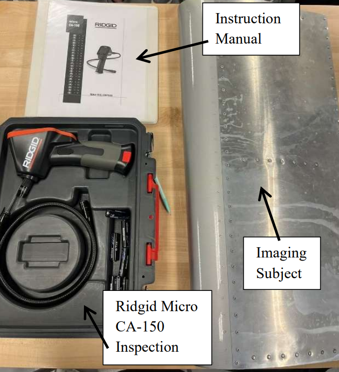
    
<em>Borescope & visual inspection equipment</em>

  

  

    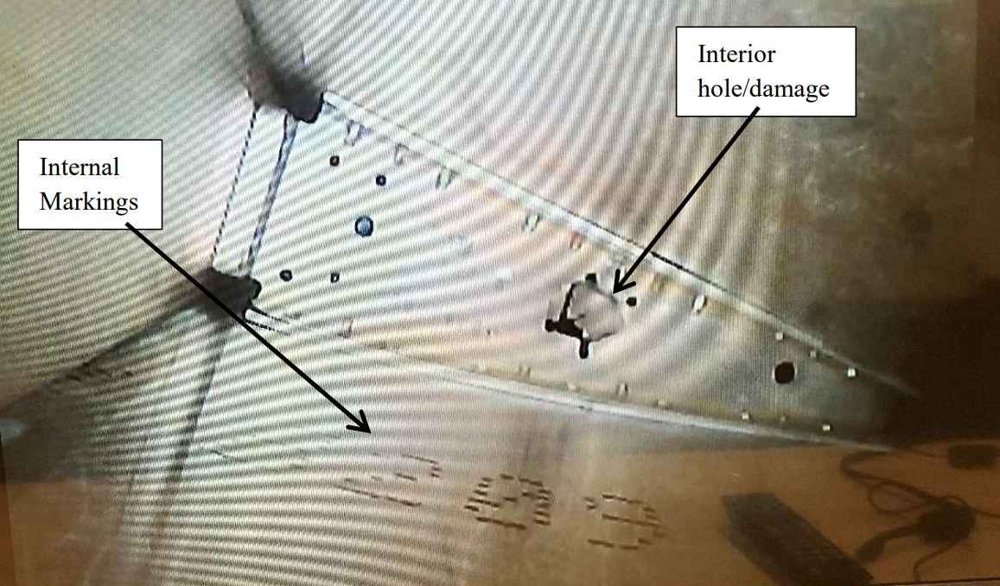
    
<em>Borescope imagery of airfoil interior damage</em>

  

The primary objectives of the visual inspection station in the NDE lab were to:

- Identify surface-level defects such as cracks, corrosion, and deformation  
- Demonstrate limitations of human vision & the need for optical aids  
- Highlight the importance of inspection equipment & lighting conditions  

---

### Thermography  
In the thermography section, an infrared camera was used to observe temperature variations using cold water & a heat blanket.

  
  

    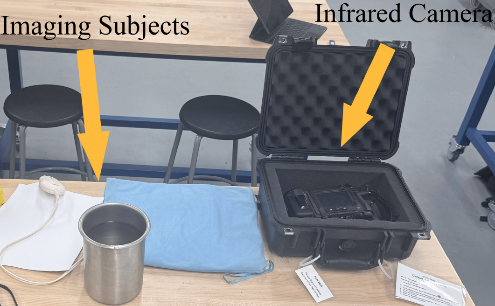
    
<em>Thermography equipment</em>

  

  

    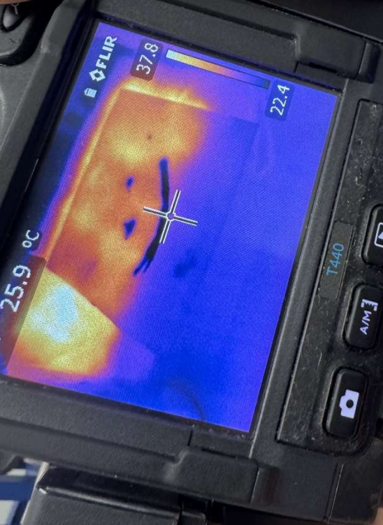
    
<em>Infrared camera imagery</em>

  

Key takeaways & objectives from the thermography NDE method include:

- Detecting thermal gradients indicating heat flow & potential defects
- Visualizing hidden features through temperature contrast  

---

### Radiography (X-ray Imaging)  
Due to safety precautions, we familiarized ourselves with the radiography setup, but analyzed pre-captured X-ray images to study internal features of the test specimen seen below.

  
  

    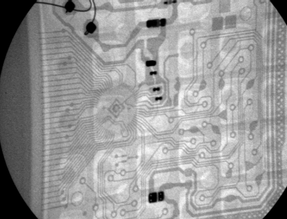
    
<em>X-ray imagery of a calculator's pcb</em>

  

  

    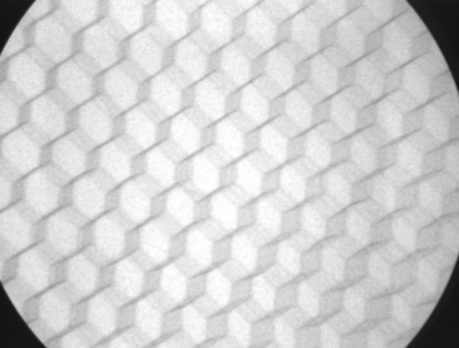
    
<em>X-ray imagery of aluminum honeycomb sample</em>

  

Radiography is one of the most versatile NDE methods. Some of the key capabilities & takeaways were observing how the method:

- Revealed internal structures such as voids, inclusions, and embedded objects  
- Demonstrated how material density affects X-ray attenuation  
- Provided high-resolution imagery of internal defects that remain undetectable from visual inspection

---

### Liquid Penetrant Inspection  
The liquid penetrant inspection station utilized a dye/penetrant system, which was applied to metallic components to highlight surface defects.

The equipment used, as well as the liquid penetrant results, are displayed in the images below.

    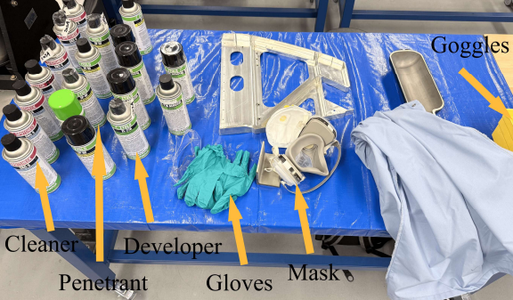
    
<em>Liquid penetrant inspection materials & safety equipment</em>

  
  

    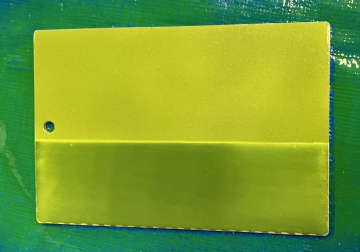
    
<em>Metal plate immediately after penetrant application</em>

  

  

    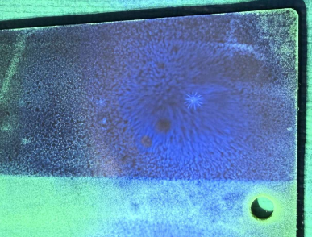
    
<em>Surface defect revealed by liquied penetrant inspection</em>

  

The primary objectives when using liquid penetrant inspection for non-destructive evaluation are:

- Using capillary action to flow penetrant into small surface discontinuities  
- Allow the developer solution to enhance the visibility of defects under proper lighting conditions
- Effectively reveal fine cracks that are not visible to the naked eye  

---

### Ultrasonic Testing  
To evaluate internal discontinuities in structures, we used an ultrasonic probe to send high-frequency sound waves through the test blocks seen below.

  
  

    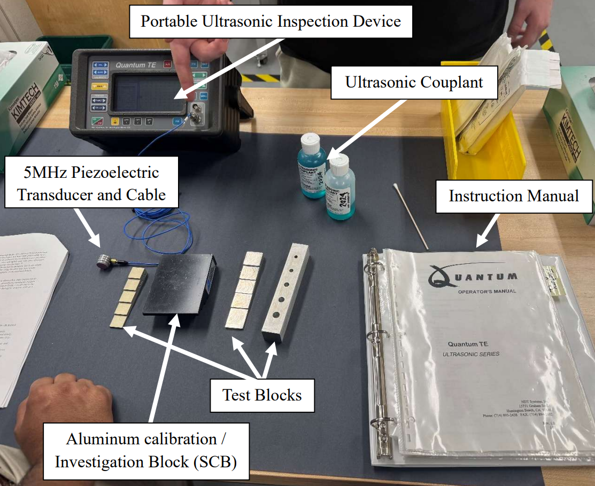
    
<em>Materials & equipment for ultrasonic NDE testing</em>

  

  

    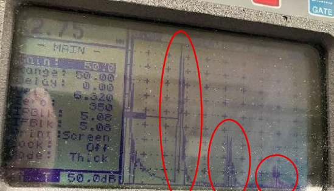
    
<em>Reflected waves indicating internal structural discontinuities</em>

  

Ultrasonic NDE is difficult to utilize on large-scale models; however, for smaller samples, it is extremely useful to:

- Detect internal features via reflected wave signals (echo patterns)  
- Identify discontinuities such as holes or material boundaries  
- Demonstrate sensitivity to probe placement & coupling quality  

---

## Valuable Takeaways  

This laboratory gave me the opportunity to explore a variety of different non-destructive evaluation methods commonly used in aerospace applications to analyze structural health & internal defects of important components.

Some of the key takeaways I gathered from the different NDE methods were that:

- **Selection Matters:** No single NDE technique is sufficient for all defect types. Each method is optimized for specific flaw detection scenarios.  

- **Surface vs. Internal Detection:** Techniques like liquid penetrant & visual inspection are ideal for surface flaws, while ultrasonics and radiography are better suited for internal defect detection.  

- **Physics Related Applications:** Understanding wave propagation, heat transfer, and electromagnetic interactions is critical to interpreting NDE results.  

- **Practical Limitations:** Real-world inspections depend heavily on data acquisition setups, equipment calibration, and environmental conditions.  

- **Engineering Relevance:** NDE plays a critical role in aerospace safety, structural integrity, and maintenance, enabling engineers to spot concerns without compromising components.  

