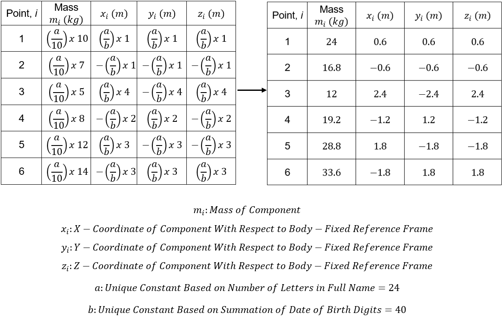
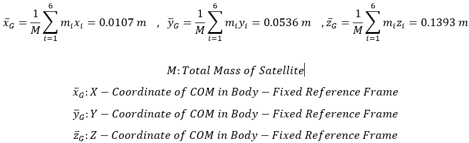
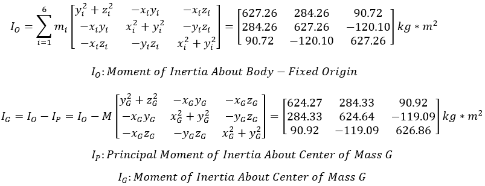
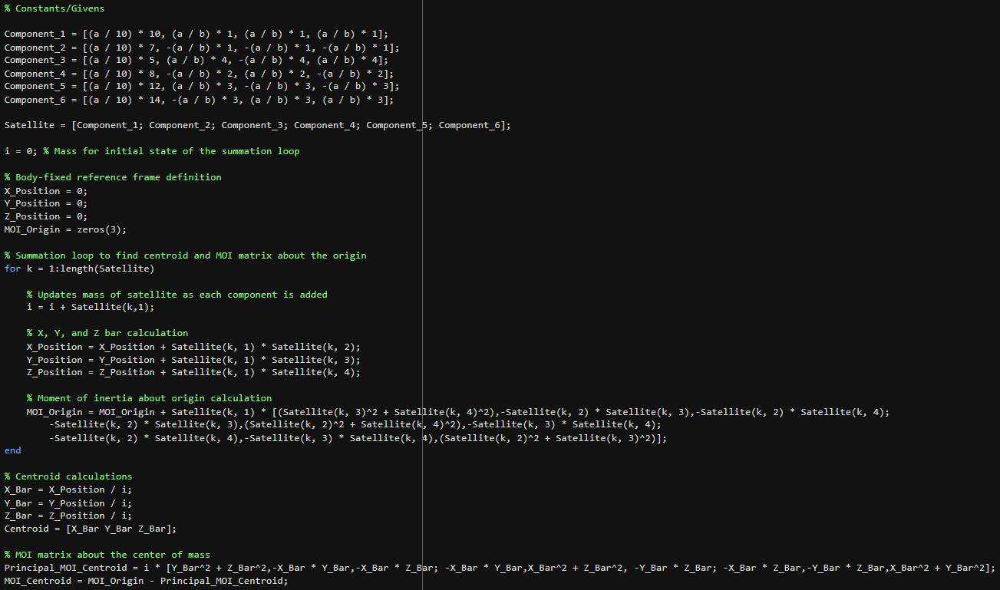
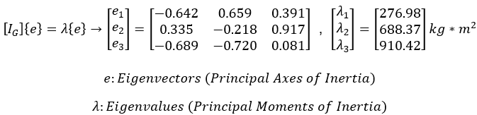
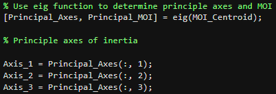
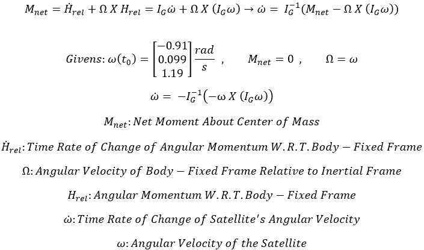
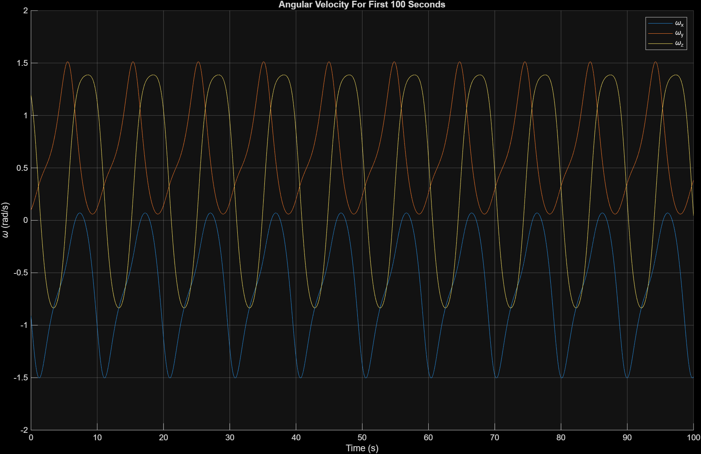
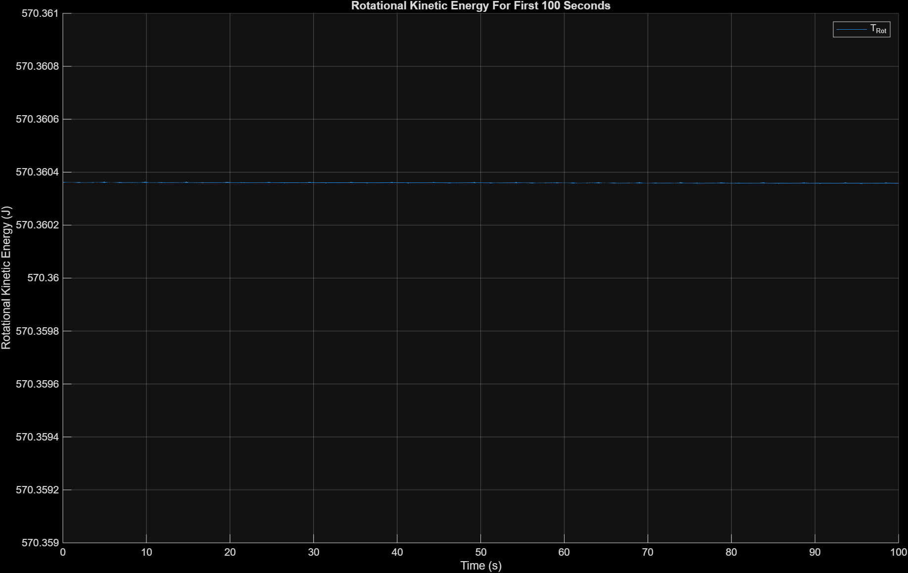

**Role:** Dynamics & Simulation Engineer  
**Institution:** Embry-Riddle Aeronautical University  
**Course:** AE 426 – Spacecraft Attitude Dynamics  
**Date:** March - April 2025  
**Tools:** MATLAB, ODE45 Numerical Integration, Linear Algebra

---

## Engineering Snapshot

**Project Type:** Spacecraft Attitude Dynamics Simulation  

**Key Concepts:**  
Rigid body dynamics | Inertia tensors | Principal axes of inertia | Euler’s equations | Numerical ODE integration

**My Contributions:**

- Modeled a six-component satellite as a rigid body with fixed point-mass components
- Computed the spacecraft **center of mass & inertia matrices** using MATLAB
- Determined the **principal axes & moments of inertia** through eigenvalue decomposition
- Implemented **Euler’s rotational equations of motion** using MATLAB’s ODE45 numerical solver
- Simulated **100 seconds of torque-free rotational motion**
- Verified **rotational kinetic energy conservation** to validate the computational model

**Key Result:**  
The simulation demonstrated stable torque-free rotational motion while maintaining nearly constant rotational kinetic energy, confirming the expected physical behavior of a rigid spacecraft.

---

## Project Overview

This project focused on the modeling & simulation of rigid satellite rotational dynamics using MATLAB. The main objective was to analyze how the angular velocity of a spacecraft evolves over time in the absence of external torques, using classical rigid body dynamics.

The satellite was modeled as a system of six fixed components, each with a defined mass & position within a body-fixed reference frame. Treating these components as point masses allowed the satellite's mass properties to be calculated directly from their spatial distribution.

Analysis of the system's dynamics was split into three major steps:

- Determining the center of mass & inertia properties of the satellite
- Evaluating the principal axes & moments of inertia
- Simulating the spacecraft's rotational motion using Euler's equations

The final simulation computed the satellite's angular velocity over a 100-second time interval, while verifying the conservation of rotational kinetic energy, which should remain constant in the absence of external torques.

This type of analysis forms the foundation of spacecraft attitude dynamics, where understanding rotational behavior is essential for designing stable satellites & effective attitude control systems.

---

## System Modeling & Mass Properties

The first deliverables for the project were the satellite's mass distribution & inertial properties.

Each of the six components was defined by:

- Mass
- Position vector with respect to the body-fixed frame's origin

The values were derived using two unique constants defined by the number of letters in my full name & the sum of digits that make up my birthdate. The resulting mass & position of each component are displayed in the table below.

<em>Component masses & coordinates in body-fixed reference frame</em>

Treating the components as point masses simplified the calculations required to determine the satellite's key physical properties.

### Center of Mass

The body-fixed coordinates of the center of mass (COM) were calculated using the mass-weighted average of the position of each component.

<em>Center of mass calculation</em>

In practice, the COM is an essential parameter that influences the design implementation of key attitude determination & control components such as thrusters, sensors, and control actuators.

### Moment of Inertia Matrix

Next, I computed the moment of inertia matrices about both:

- The origin of the body-fixed frame  
- The satellite’s center of mass (G)

<em>Moment of inertia matrices</em>

The inertia matrix describes how the satellite's mass is distributed relative to the axes of rotation. This information is critical in satellite design because it defines how easily a spacecraft can rotate about each axis.

I created a MATLAB loop to iterate through each component's physical properties and account for the individual contributions to the center of mass & inertia matrices.

<em>MATLAB physical properties loop</em>

---

## Principal Axes and Moments of Inertia

Once the inertia matrix about the center of mass was obtained, the next step was determining the principal axes & moments of inertia.

These quantities were found by conducting an eigenvalue decomposition of the inertia matrix. The resulting eigenvalues correspond to the principal moments of inertia, while the eigenvectors define the principal axes of the satellite.

<em>Eigenvalue decomposition</em>

Using the MATLAB built-in "eig()" function, I transformed the inertia matrix into its diagonal form, yielding a coordinate system where the rotational dynamics become significantly easier to analyze.

<em>Eigenvalues & principal inertia properties</em>

Working in the principal axis frame is common in attitude dynamics because it simplifies the governing equations of rotational motion. This simplification helps engineers understand how a spacecraft naturally prefers to rotate based on its mass distribution.

---

## Rotational Dynamics Simulation

After determining the satellite's inertia properties, the final stage of the project involved simulating the satellite's rotational motion using Euler's equations for rigid body dynamics.

For a spacecraft experiencing no external torques, Euler's equations reduce to a system of coupled differential equations describing how the angular velocity vector evolves over time.

<em>Euler's equations for rotational dynamics</em>

In order to numerically solve the system of equations, I used MATLAB's ordinary differential equation solver (ODE45), which employs a Runge-Kutta method to integrate non-linear dynamic systems.

The simulation used the initial angular velocity vector (omega), alongside the moment of inertia matrix about G, and a defined simulation period as inputs. The ODE45 function then computed the satellite's angular velocity components over time as seen below.

<em>Angular velocity components throughout the simulation period</em>

The results show that each component of the angular velocity vector oscillates consistently between a unique range & setpoint throughout the simulation.

Modeling this behavior provides crucial information for engineers to understand how a spacecraft will behave if it begins rotating unexpectedly or temporarily loses control system authority.

---

To verify the physical accuracy of the simulation, I used a MATLAB loop to compute the satellite's rotational kinetic energy at each time step.

For a rigid body rotating without external torques, rotational kinetic energy should remain constant over time. Any significant deviation would indicate instability or modeling errors.

<em>Rotational kinetic energy over throughout the simulation period</em>

The MATLAB figure above displays the rotational kinetic energy remaining effectively constant throughout the simulation. This behavior confirms the conservation of energy expectation & validates the accuracy of my modeling techniques.

Validating model results is a vital step in aerospace system design to support underlying physical principles.

## Key Takeaways

This project provided hands-on experience applying rigid body dynamics & numerical simulation techniques to spacecraft motion.

By combining analytical calculations with MATLAB-based simulation, I was able to model the rotational behavior of a satellite, determining its inertial properties to predict dynamic response over time.

Throughout the project, I developed skills:

- Computing spacecraft mass properties & inertia matrices
- Using eigenvalue analysis to determine principal axes
- Implementing numerical ODE solvers for dynamic simulation
- Verifying model accuracy using first-principles applications

Ultimately, I found a lot of value in using fundamental attitude dynamics & control methods to support satellite control system verification.
