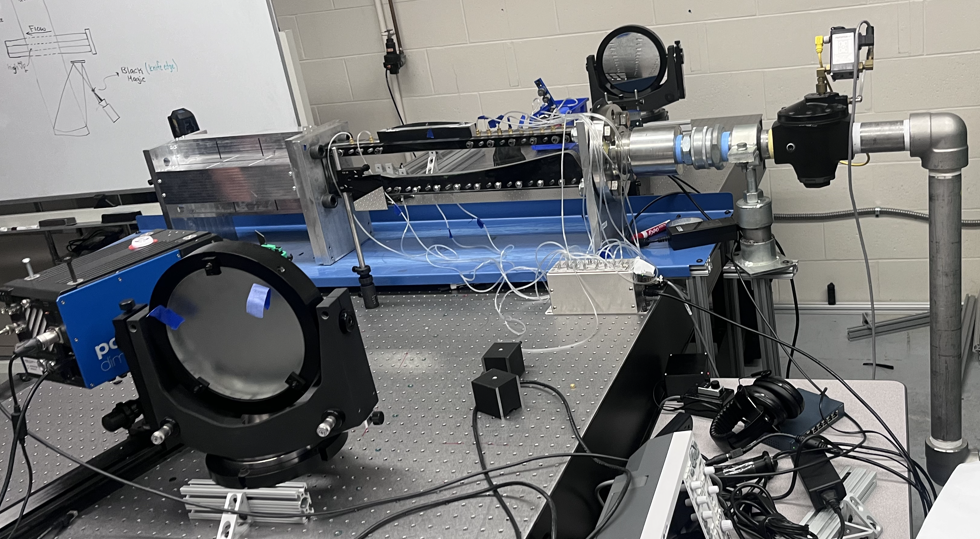
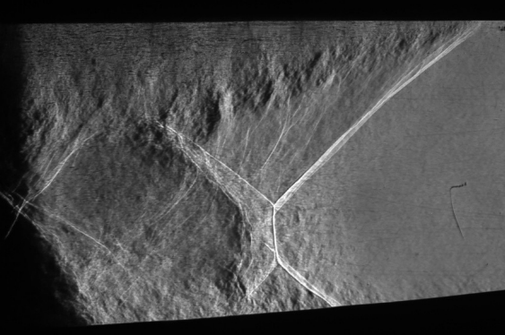
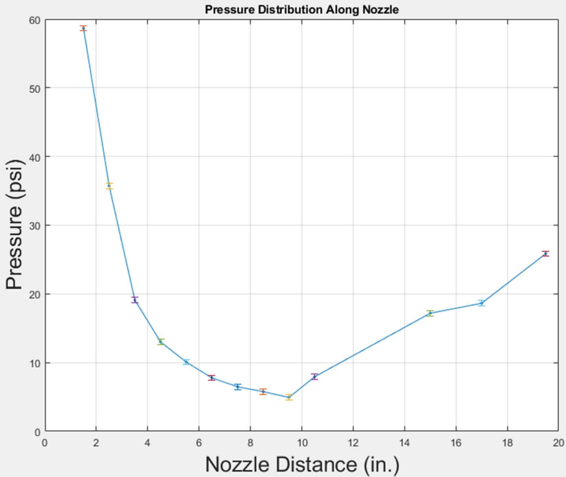

## Supersonic Wind Tunnel & Schlieren Imaging  
**Institution:** Embry-Riddle Aeronautical University  
**Course:** AE 315 - Experimental Aerodynamics Lab  
**Dates:** April 2025  
**Equipment & Tools:** Blow-Down Supersonic Wind Tunnel | Schlieren Imaging Apparatus | High-Speed Camera | De Laval Nozzle | MATLAB

---

## Experiment Overview  

This experiment focused on analyzing compressible flow behavior within a supersonic wind tunnel using an over-expanded converging-diverging nozzle. The primary objective was to visualize & quantify shock formation, as well as determine key flow properties using both pressure measurements & Schlieren imaging techniques.

A major component of the experiment involved identifying the location & characteristics of a separation shock within the nozzle. Experimental data was collected using pressure taps distributed along the nozzle length, while Schlieren imaging provided a visual representation of density gradients in the flow.

Important performance metrics obtained throughout the lab procedure & data reduction include:
- Nozzle pressure ratio (NPR)  
- Shock strength (pressure ratio across the shock)  
- Mach number in the test section  
- Pressure distribution along the nozzle  
- Mass flow rate through the system  

By combining flow visualization with quantitative measurements, this experiment provided an insightful demonstration of real supersonic flow behavior & the limitations of ideal isentropic assumptions.

---

## Procedure & Results  

The experimental setup consisted of a blow-down supersonic wind tunnel where compressed air from a reservoir tank was rapidly released through a converging-diverging nozzle. Pressure taps lined the nozzle to measure static pressure, while a Schlieren imaging system was used to capture high-speed imagery of shock structures within the flow.

    
    
<em>Supersonic wind tunnel with Schlieren imaging mirrors</em>

The Schlieren system utilized mirrors & lenses to visualize changes in air density, allowing for clear observation of shock waves & flow separation characteristics that are otherwise invisible to the naked eye.

The general procedure followed throughout the experiment included:
- Charging the reservoir tank to a controlled high pressure  
- Releasing the air through the converging-diverging nozzle 
- Recording pressure data at each tap along the nozzle  
- Capturing Schlieren images of the flow  
- Using pressure measurements to determine pressure ratios & flow properties  
- Applying compressible flow relations to determine Mach number & mass flow rate  

    
    
<em>Schlieren image of separation shock in the over-expanded nozzle</em>

The Schlieren image shows the separation shock & turbulence within the diverging section of the nozzle. A distinct flow separation region forms downstream of the shock, indicating that the nozzle is operating in an over-expanded condition.

    
    
<em>Static pressure distribution along the nozzle</em>

The pressure distribution plot reveals a rapid decrease in pressure through the converging and early diverging sections, followed by a sudden pressure rise between approximately 9.5 and 10.5 inches, indicating the location of the separation shock.

Based on the pressure measurements, several key flow parameters were determined using MATLAB to manipulate the raw data:

- **Nozzle Pressure Ratio (NPR):** The ratio of reservoir pressure to exit pressure was calculated to be ~3.60, defining the operating condition of the nozzle.

- **Shock Strength:** The pressure ratio across the shock (between taps 9 & 10) was found to be ~1.61, indicating a moderate normal shock strength.

- **Mach Number:** Using isentropic relations & pressure ratios, the Mach number upstream of the shock was calculated to be ~2.30, confirming supersonic flow in the test section. 

- **Mass Flow Rate:** Based on stagnation conditions & throat area, the mass flow rate through the nozzle was determined to be approximately 0.492 kg/s. 

ultimately, the experimental results matched expected behavior for an over-expanded nozzle, where flow separation & shock formation occur within the diverging section due to the ambient back pressure being greater than the nozzle exit pressure.

---

## Valuable Takeaways  

This experiment provided an intuitive, hands-on introduction to supersonic flow analysis by combining visualization techniques with compressible flow theory.

Valuable takeaways I gained from the supersonic wind tunnel experiment are summarized below.

- **Understanding shock behavior:** This lab demonstrated how shocks form in over-expanded nozzles & how they influence pressure distribution & flow separation.

- **Schlieren imaging insight:** Visualizing density gradients made it much easier to interpret flow features such as shocks, shear layers, and separation regions that are otherwise abstract.

- **Pressure-based flow analysis:** Using pressure tap data to determine Mach number, shock strength, and NPR highlighted the power of indirect measurement techniques for compressible flow.

- **Integration of theory & experiment:** This lab emphasized how compressible flow equations, experimental data, and visualization techniques work together to fully characterize high-speed aerodynamic systems.

Overall, this experiment strengthened my understanding of compressible aerodynamics & provided hands-on experience analyzing shock behavior in a controlled supersonic wind tunnel.
