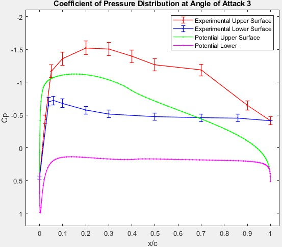
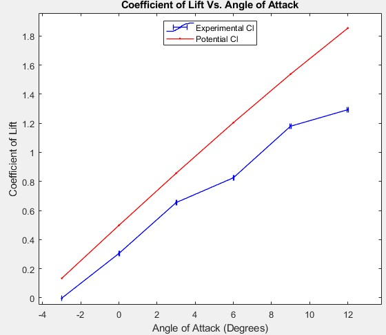
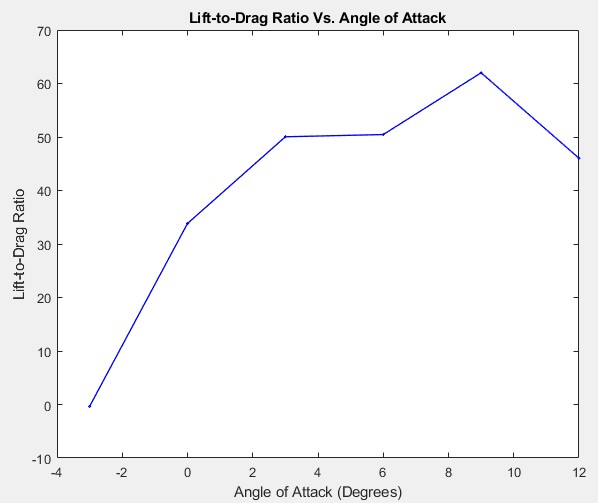

# Airfoil Performance Metrics at Varying Angles of Attack  
**Institution:** Embry-Riddle Aeronautical University  
**Course:** AE 315 - Experimental Aerodynamics Lab  
**Dates:** March 2025  
**Equipment & Tools:** Subsonic Wind Tunnel, NACA 4412 Airfoil, Pitot-Static Probes, Distributed Pressure Taps, MATLAB

---

## Experiment Overview  

This experiment focused on characterizing the aerodynamic performance of a NACA 4412 airfoil across a range of angles of attack (AoAs) using wind tunnel testing. The primary objective was to experimentally determine key aerodynamic coefficients and compare them to theoretical predictions based on potential flow calculations.

Data was collected at a constant freestream velocity of approximately 15 m/s for angles of attack ranging from -3° to 12°. A major emphasis of the analysis was to account for propagated uncertainty, resulting in a more realistic interpretation of experimental data.

Important airfoil performance metrics obtained throughout data collection & post-lab analysis included:
- Coefficient of lift (Cl)  
- Coefficient of drag (Cd)  
- Coefficient of pressure distribution (Cp vs. x/c)  
- Lift-to-drag ratio (Cl/Cd)  
- Zero-lift angle of attack  

By analyzing these aerodynamic parameters for each AoA, the experiment provided valuable insight into how airfoil performance varies with AoA & how real-world effects deviate from idealized theoretical models.

---

## Procedure & Results  

The experimental setup shown utilized a subsonic wind tunnel containing a NACA 4412 airfoil lined with pressure taps along both upper & lower surfaces. A pitot-static probe was used to measure freestream dynamic pressure, while a wake survey probe captured downstream velocity profiles used to determine drag.

    
    
<em>Wind tunnel test section</em>

Utilizing pressure taps along the airfoil provide measurements of local pressure distributions, which were used to compute the coefficient of pressure across the upper & lower surfaces. These values were then integrated to determine lift coefficients, while drag was calculated based on the velocity difference in the wake region.

The general procedure for collecting data & obtaining relevant results consisted of:
- Setting the airfoil to a specified angle of attack  
- Measuring dynamic pressure using a pitot-static probe  
- Recording pressure data from surface taps along the airfoil  
- Performing wake surveys to capture downstream velocity profiles  
- Converting raw pressure & velocity data into aerodynamic coefficients  
- Applying uncertainty propagation methods to all calculated values  

    
    
<em>Coefficient of pressure distribution at 3° AoA</em>

The pressure distribution shown above displays clear differences between upper & lower surfaces, with lower pressures observed on the upper surface contributing to lift generation. As AoA increased, the pressure differential became more pronounced, indicating increased lift production.

    
    
<em>Coefficient of lift vs. angle of attack</em>

The lift curve displayed an approximately linear trend with increasing angle of attack, consistent with thin airfoil theory. The maximum measured lift coefficient was approximately 1.29 ± 0.03 at 12° AoA. Whereas the lift coefficient was approximately zero at -3°, supporting the theoretical expectation for the zero-lift angle of attack.

    
    
<em>Coefficient of drag vs. angle of attack</em>

Drag coefficients increased with angle of attack, ranging from approximately 0.009 at 0° to 0.028 at 12°, highlighting the growing influence of viscous effects & flow separation at higher AoA. Unlike lift, the Cd curve doesn't align with the theoretical behavior because drag cannot be predicted by potential flow theory, which assumes inviscid flow.

    
    
<em>Lift-to-drag ratio vs. angle of attack</em>

The lift-to-drag ratio increased with angle of attack up to approximately 9° as seen above. A maximum value of 62 was observed before decreasing due to increased drag & flow separation.

Overall, the experimental results showed strong agreement with potential flow predictions for lift behavior, while deviations in the drag coefficients highlighted the limitations of idealized models.

---

## Valuable Takeaways  

This experiment provided a comprehensive look into aerodynamic performance analysis through both direct measurement & MATLAB data reduction.

Some of the key takeaways from the data collection & analysis portions of the airfoil lab include:

- **Understanding airfoil performance:** This lab reinforced how lift & drag coefficients vary with AoA, emphasizing the importance of aerodynamic efficiency in airfoil design.

- **Pressure-based force calculation:** Using Cp distributions to derive lift coefficients provided a deeper understanding of how surface pressure translates into aerodynamic forces.

- **Wake survey drag measurement:** The velocity deficit method demonstrated how drag can be experimentally determined even when it cannot be predicted by simplified theoretical models.

- **Uncertainty propagation:** Incorporating propagated uncertainty into all calculated values highlighted the importance of quantifying experimental error & interpreting data within realistic bounds.

- **Limitations of potential flow theory:** While theoretical models accurately predicted lift trends, discrepancies in drag coefficients emphasized the role of viscosity, turbulence, and real-world flow effects.

Overall, this lab strengthened my ability to analyze aerodynamic systems using both experimental data & theoretical comparisons.
