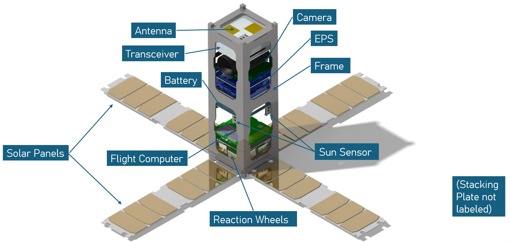

## CubeSat Senior Design

**Role:** Lead Environmental Engineer & Requirements Developer  
**Institution:** Embry-Riddle Aeronautical University  
**Mission Concept:** Space Situational Awareness in GEO  

---

## Project Overview

My capstone project is focused on the conceptual design of a 3U CubeSat intended to conduct space situational awareness (SSA) operations in Geosynchronous Earth Orbit. Our group is comprised of 8 students with unique roles contributing to the design and integration of the spacecraft.  

The primary objective of the mission is to perform optical SSA on all objects in the geostationary belt, to include both active satellites & debris. To accomplish this task, the spacecraft will take multi-image, inertial stare collects of GEO objects and identify resident space objects (RSOs) captured in each image.  

Ultimately, the CubeSat will obtain estimated orbital trajectories of each RSO and create an SSA catalog of the GEO belt. Additionally, the mission lifetime & total cost cap for the project are set at 2 years & $200,000, split between build cost, labor hours, and testing facility usage.  

To track our progress, the project follows a formal systems engineering lifecycle, with four milestone reviews spread from August 2025 to April 2026. So far, we have completed the Systems Requirements Review, Preliminary Design Review, and Critical Design Review, with Operational Readiness Review on the horizon to be completed in the coming months.  

---

## My Responsibilities

Within the team, I hold the roles of Lead Environmental Engineer & Requirements Developer. Though I've contributed to design decisions & mission planning across the full scope of the project, some of my primary responsibilities have included:

### Systems Engineering
- Development & maintenance of system-level requirements across the full work breakdown structure
- Establishing verification methods linking system requirements to quantifiable verification & validation metrics
- Drafting end-to-end test plans adhering to NASA compliance documents, supporting the development of a launch-ready spacecraft

### Environmental Analysis & Thermal Design
- Conducted trade studies for thermal control & radiation protection subsystems, alongside contributions to various satellite bus trade studies
- Analyzing hostile mission environments, potential failure modes, and mitigation strategies to ensure reliable operation throughout the mission lifecycle

### Integration Considerations
- Developing interfacing flowcharts to denote the transfer of commands, data, and power within the spacecraft
- 3D modeling & assembly of subsystems in CATIA, adhering to CubeSat deployer integration requirements
- Evaluating size, weight, power, and cost constraints (SWaP-C) as mission hardware & design considerations evolved

---

### 
---

## Key Takeaways

This project given me a lot of insight into the importance of managing technical tradeoffs & understanding how design decisions affect system integration in large-scale mission environments. The reinforcement of working in multidisciplinary teams to cohesively design a spacecraft has sharpened my technical communication skills within the team as well as in presentation settings.

As I begin my career in the aerospace industry, I'm thankful to have had this design project challenge me & provide ample learning opportunities in an industry-level, systems engineering environment.
