**Role:** Lead Environmental Engineer & Requirements Developer  
**Institution:** Embry-Riddle Aeronautical University  
**Course:** Spacecraft Preliminary Design & Spacecraft Detail Design (AE 427/445)  
**Date:** August 2025 - April 2026  
**Tools:** STK, MATLAB, Ansys Thermal Desktop, CATIA, Microsoft Suite

---

## Project Overview

My capstone project is focused on the conceptual design of a 3U CubeSat intended to conduct space situational awareness (SSA) operations in Geosynchronous Earth Orbit. Our group is comprised of 8 students, each with a unique role in the design & integration of the spacecraft.  

The primary objective of the mission is to perform optical SSA on all objects in the geostationary belt, to include both active satellites & debris. To accomplish this task, the spacecraft will take multi-image, inertial stare collects of GEO objects & identify resident space objects (RSOs) captured in each image.  

Ultimately, the CubeSat will obtain estimated orbital trajectories of each RSO & create an SSA catalog of the GEO belt. Additionally, the mission lifetime & total cost cap for the project are set at 2 years & $200,000, split between build cost, labor hours, and testing facility usage.  

To track our progress, the project follows a formal systems engineering lifecycle, with four milestone reviews spread from August 2025 to April 2026. So far, we have completed the Systems Requirements Review, Preliminary Design Review, and Critical Design Review, with Operational Readiness Review on the horizon to be completed in the coming months.  

  
  

    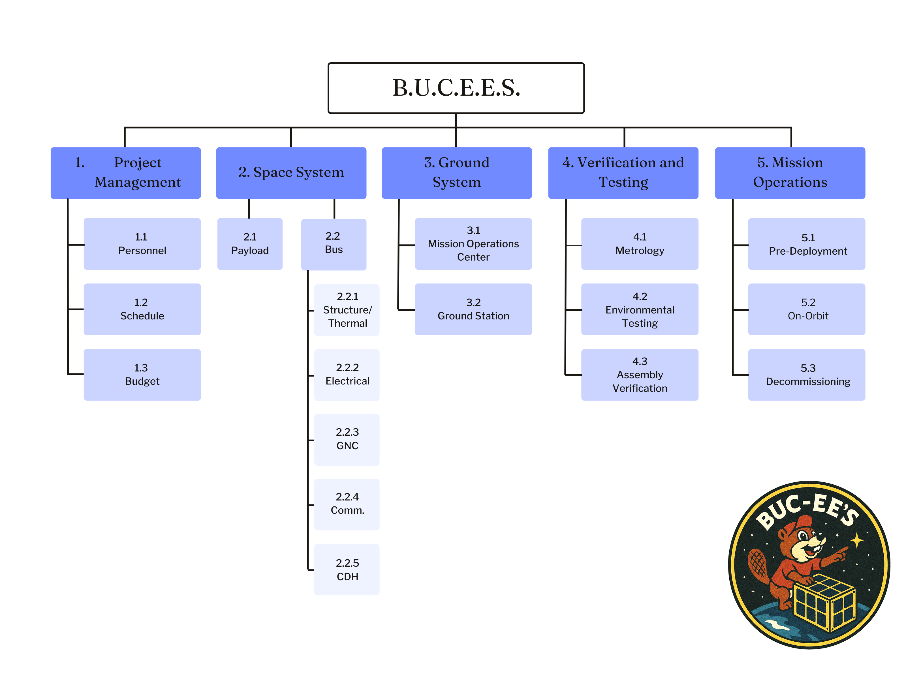
    
<em>BUCEES Work Breakdown Structure (WBS)</em>

  

  

    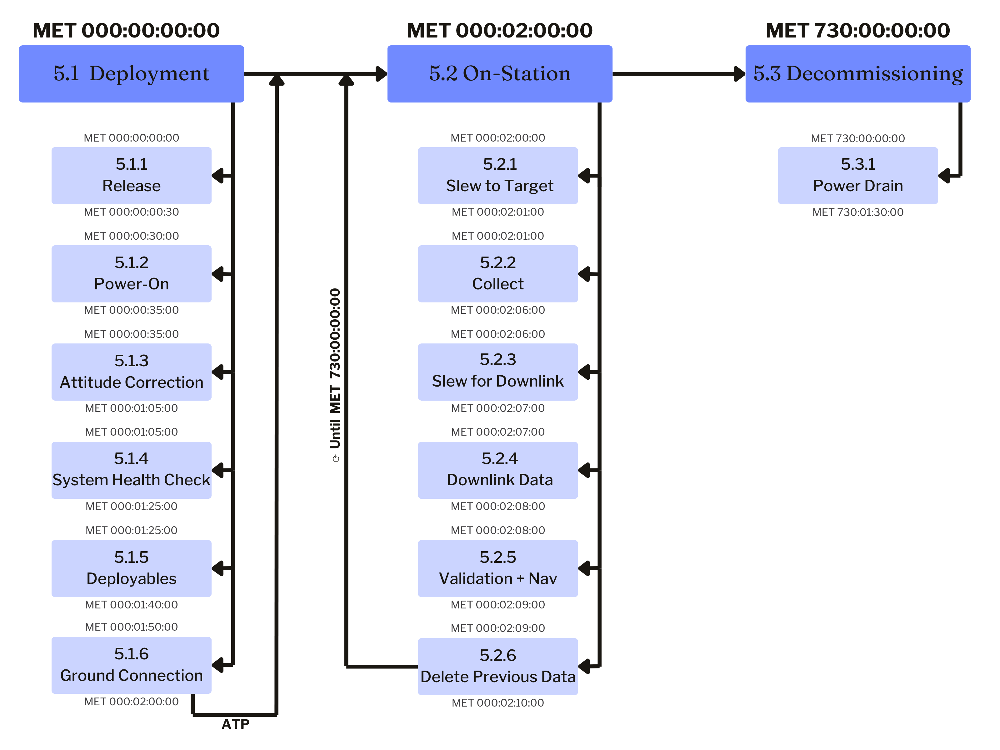
    
<em>Concept of Operations (CONOPS) flowchart displaying the primary mission phases from deployment to decommissioning</em>

  

Displayed above are the work breakdown structure & concept of operations for our mission. As true Daytona Beach residents, we named our CubeSat B.U.C.E.E.S (Breakthrough Utilization of CubeSats for Environmental Examination of Space). These documents define the structure of the project as a whole & serve as the organizational skeleton for system-level requirements.

---

## My Responsibilities

I've contributed to design decisions & mission planning across the full scope of the project. However, my official roles within the team are Lead Environmental Engineer & Requirements Developer. The sections below include my primary responsibilities & examples of my contributions across a variety of major deliverables.

### Systems Engineering
- **Development & maintenance of system-level requirements across the full work breakdown structure**

    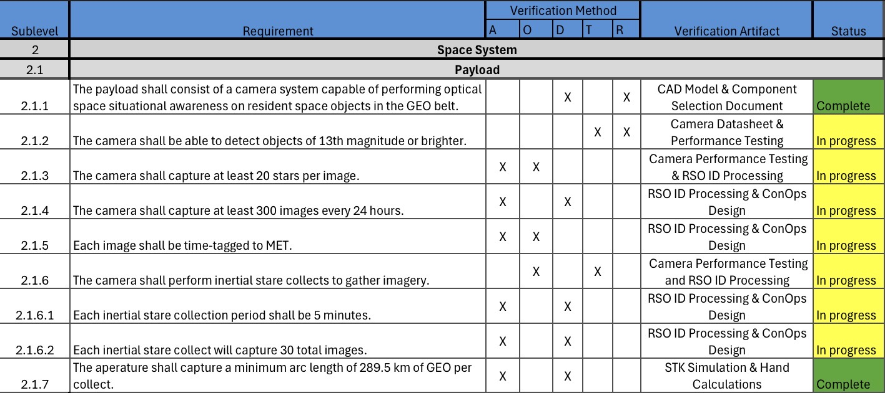
    
<em>Sample set of payload requirements</em>

Provided above is a set of high-level requirements I derived to define the CubeSat's payload & performance characteristics. The motivation for these requirements stems from our Mission Needs Document (MND), which defines the mission objective, budget constraints, and compliance documents that our spacecraft must adhere to.

- **Establishing verification methods linking system requirements to quantifiable verification & validation metrics**

As I developed requirements for each node of the WBS, verification methods & artifacts were chosen to track the status of each requirement. Many requirements were drawn from the MND & various compliance/testing documents such as NASA's General Environmental Verification Standard (GEVS).

However, it was up to our team to determine verification methods & artifacts for each requirement. I tackled this challenge by communicating with my team to learn what tests/standards each of their respective subsystems had to meet to be considered successful. An important emphasis during this stage was to ensure each requirement was Specific, Measurable, Achievable, Relevant, and Time-bound (SMART).

- **Drafting end-to-end test plans adhering to NASA compliance documents, supporting the development of a launch-ready spacecraft**

### Environmental Analysis & Thermal Design

As the team's environmental engineer, one of my most important responsibilities is to analyze the variety of hostile mission environments the CubeSat will encounter & develop preventative measures to ensure safe operation throughout the mission lifecycle. Provided below are examples of analysis I conducted regarding space environmental risk analysis & logistics for our spacecraft.

- **Conducted trade studies for thermal control & radiation protection subsystems, alongside contributions to various satellite bus trade studies**

  
  

    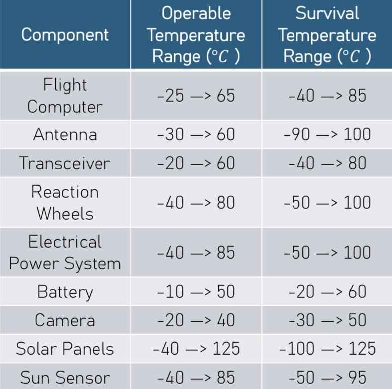
    
<em>Operational & survivable temperature ranges for primary CubeSat components (*) Components that limit the critical temperature range (lower limit -> battery, upper limit -> camera)</em>

  

  

    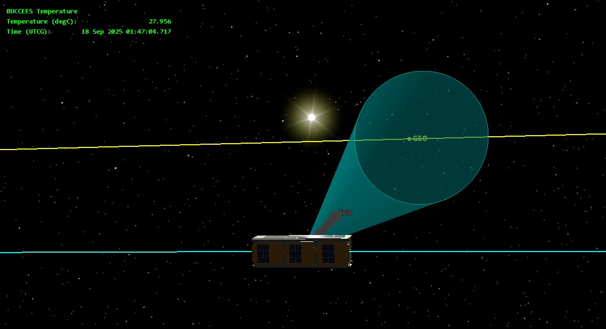
    
<em>STK mission environment simulation displaying CubeSat temperature & optical coverage of GEO based on the camera's field of view</em>

  

Based on the temperature ranges in the table above, I defined a critical temperature range to keep the CubeSat within at all times throughout the mission life. To ensure functionality in all environments, this range was defined between -10 & +40 degrees Celsius.

The provided snapshot is from an STK environmental analysis I conducted to determine the temperature extremes our CubeSat would be exposed to over the 2-year mission life. Then I employed STK's SEET-Thermal (Space Environmental Effects Tool) model to define the spacecraft's radiative surface area, emissivity, absorptivity, and internal heat dissipation. Applying this model to our CubeSat's orbit throughout the simulation period allowed me to generate reports that displayed hourly temperature readings, as well as the maximum, minimum, and averages for the full mission:
- Maximum Temperature (Peak Power Usage & Solar Flux): +35 degrees Celsius
- Minimum Temperature (Min Power Usage & Longest Eclipse): -50 degrees Celsius
- Average Temperature (Mean Power Usage & Solar Flux): +29 degrees Celsius

The max & average temperatures from the simulation fall well within the critical range; however, it is worth noting that the minimum temperature is well below the -10 degree operational limit. A few things to consider for this cold case are the time the CubeSat spends in eclipse (~65 minutes) & the absence of internal heat dissipation. The simulation doesn't account for the rate of heat transfer; it assumes that the eclipse immediately drops the spacecraft to equilibrium temperature (-50). Further calculations support the conclusion that dropping from average to minimum temperature would take over double the time of our longest eclipse; it's more reasonable to assume a 30-40 degree temperature drop.

However, this analysis still results in the CubeSat enduring a temperature swing that brings sensitive components close to the lower limit of the critical range. My solution to minimize risks associated with this temperature delta was to introduce a charging phase prior to eclipse that would allow the battery to reach max storage (40 Wh) before losing line-of-sight with the sun. This would give us the option to power internal electronics & active thermal control components to keep the spacecraft comfortably within the critical temperature range.

Using the STK data & analysis above, I derived thermal control requirements & conducted trade studies to determine optimal components for the CubeSat's thermal control subsystem:

**Passive:**
- A276 Polyurethane Coating (White)
- Multi-Layer Insulation (MLI)
- Heat Pipes

**Active:**
- Thermostat-Controlled Electric Patch Heaters

Due to strict size, weight, power, and cost constraints (SWaP-C), passive control strategies were prioritized to minimize the frequency of ground commands & points of failure.

- **Analyzing hostile mission environments, potential failure modes, and mitigation strategies to ensure reliable operation throughout the mission lifecycle**

One of the most important aspects of mission planning is accounting for the wide range of failure modes the spacecraft is susceptible to across each mission environment. To consider the overarching impact of each failure mode, we assigned likelihood & severity values that multiply together to determine the mission criticality score as seen in the table below.

  
  

    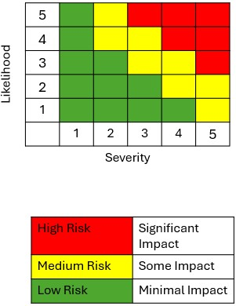
    
<em>Risk matrix</em>

  

  

    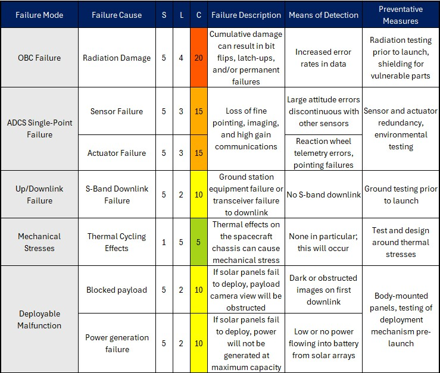
    
<em>Failure modes</em>

  

The risk matrix on the left serves as a legend to organize each failure mode into three levels of risk (Low: 0-6, Medium: 7-12, High: 13-25). The table on the right provides a sample set of failure modes we considered for the operational stage early in the design process. Each failure mode includes S (Severity)/L (Likelihood)/C (Criticality) values, how the failure would affect the CubeSat, and methods to detect or prevent the event.

An important simplification we made for our considered failure modes was to exclude launch environments & any corresponding failure modes. This assumption was made in coherence with our Mission Needs Document, which specifies that our analysis should start upon insertion into our operational orbit.

### Integration Considerations
- **Developing interfacing flowcharts to denote the transfer of commands, data, and power within the spacecraft**

    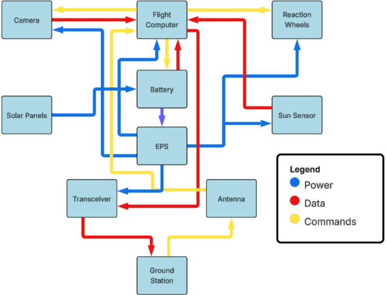
    
<em>Distribution/interfacing diagram</em>

Successful interaction between different subsystems within the CubeSat architecture is mandatory to ensure cohesive integration & functionality. The diagram above shows the base-level flow of power, data, and commands throughout the spacecraft. Some components that would constantly interface with each other back & forth (e.g., EPS/Flight Computer) have been simplified to a unidirectional arrow for organizational purposes. A ground station block is also included to define downlink/uplink communication pathways. 

In terms of on-board power, the solar panels will gather energy from the sun, which will be transferred/stored in the battery in the form of usable power. The EPS (Electrical Power Distribution Subsystem) will monitor the battery's power storage & act as the primary distributor of power to the rest of the spacecraft.

The red data distribution arrows stem from multiple components that will be gathering external data, such as RSO imagery (Camera) or the direction of the sun (sun sensor). The On-Board Computer (OBC) serves as the central hub for all data, interpreting it & sending necessary info through the communication subsystem to be downlinked to the ground station.

Tracking, Telemetry, and Commands (TT&C) all flow along yellow pathways in the diagram above. This communication path is arguably the most important, as it defines the primary transfer of system health checks, commands/updates, and ranging information between the CubeSat & ground stations.

Regarding ground stations, our mission will utilize four stations in NASA's Near Space Network (NSN) spread around the globe to ensure constant communication ability. Provided below is a table denoting the selected locations & some STK coverage analysis snapshots.

    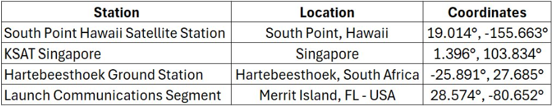
    
<em>Ground station locations</em>

A few major considerations we used to choose these ground stations were their communication frequency, location, and cost. All four stations are compatible with our communication equipment, which uses S-band frequency for downlink/uplink. The importance of their relative locations is more easily understood through the STK visuals below.

    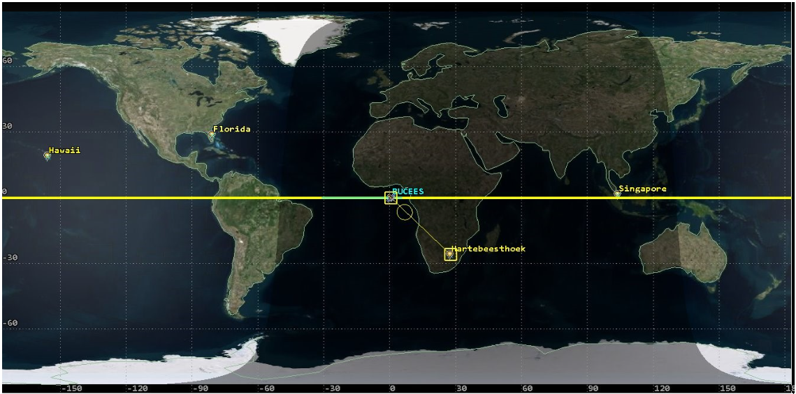
    
<em>2D representation of ground station locations/accessability</em>

The solid yellow line across the graphics window represents the access points from the CubeSat to each ground station. The fact that the access line is solid implies that the spacecraft will maintain constant coverage, allowing for downlink & uplink at any time throughout the orbit.

The figure below shows the breakdown of specific access times for each ground station over the course of a year.

    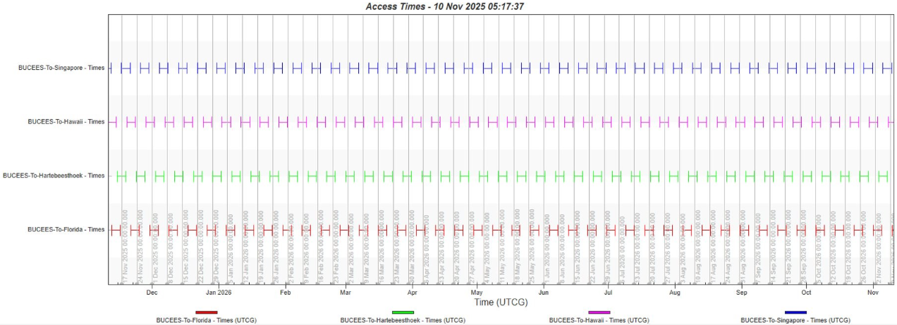
    
<em>Access times for each selected ground station</em>

- **3D modeling & assembly of subsystems in CATIA, adhering to CubeSat deployer integration requirements**

    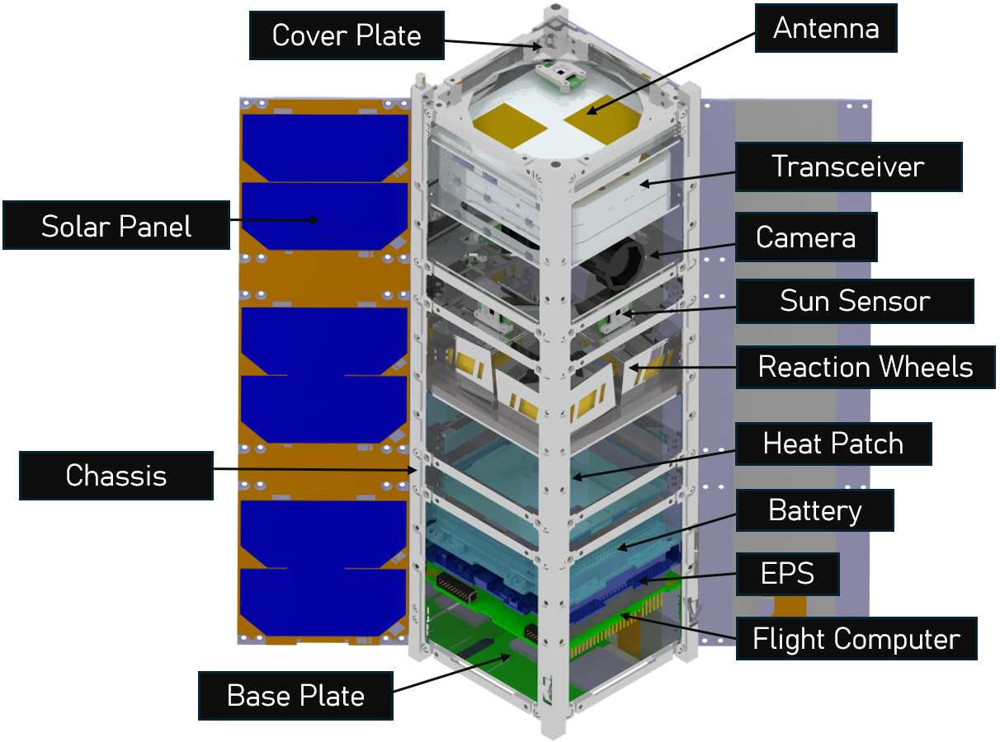
    
<em>Assembled CAD model</em>

Above is an assembled view of the CubeSat in CATIA that displays each major component of the bus/payload. The majority of 3D models were acquired directly from vendors, with exterior plates being designed in-house. The displayed image excludes MLI blankets, a solar panel, and exterior shielding plates in order to provide a clear view of the internal structure of components in the chassis.

Other important mission information we gathered from CATIA included the center of mass & moment of inertia properties of the CubeSat. These values were critical for determining how much power our attitude control system would need to slew the spacecraft to the necessary attitudes at different stages of the CONOPS.

- **Evaluating size, weight, power, and cost constraints (SWaP-C) as mission hardware & design considerations evolved**

The total cost cap of the mission was defined in the MND as $200,000, while the remaining budgets & their limits were up to us to define. The size & weight limits of the CubeSat were reliant upon the deployer that we chose. After considering a few options, we decided to use Cal Poly SLO's Poly-Picosatellite Orbital Deployer (P-POD). 

Volume & mass constraints stemmed from the deployer's CubeSat Design Specification (CDS), which sets limits at 3.405U & 6 kg, respectively. Displayed below are pie charts that represent the volume & mass of each component within the CubeSat as a percentage of the total allotted budget.

  
  

    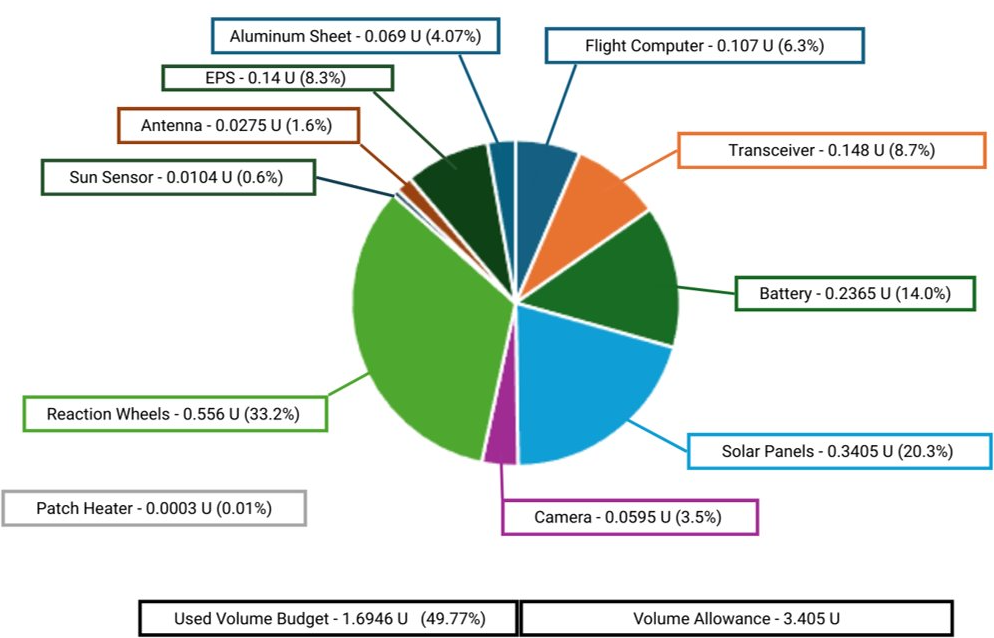
    
<em>Volume budget</em>

  

  

    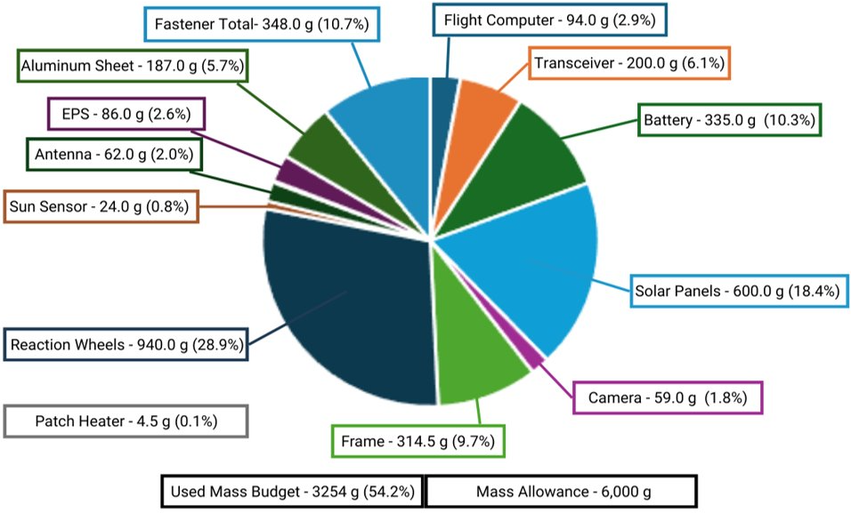
    
<em>Mass budget</em>

  

The power budget was defined by the battery we chose for the spacecraft. For this reason, we conducted trade studies for the electrical power subsystem early in the design process & prioritized a large power budget. The total storage of our selected battery is 40 watt hours & the pie chart below displays the amount of power allotted to each major component.

    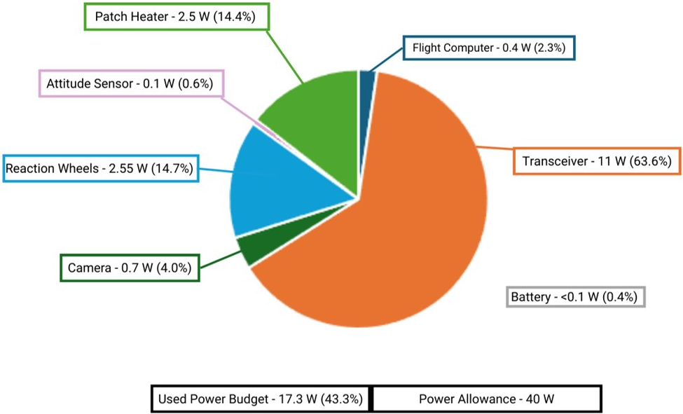
    
<em>Power budget</em>

---

## Key Takeaways

This project has given me a lot of insight into the importance of managing technical tradeoffs & understanding how design decisions affect system integration in lifecycle mission environments. The reinforcement of working in multidisciplinary teams to cohesively design a spacecraft has sharpened my technical communication skills within the team as well as in presentation settings.

As I begin my career in the aerospace industry, I'm thankful to have had this design project challenge me & provide ample learning opportunities in an industry-level, systems engineering environment.
