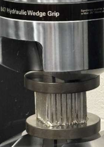
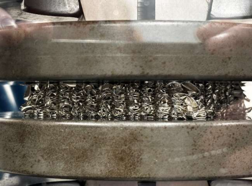
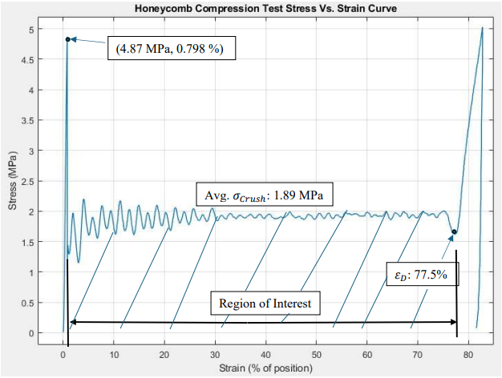

## Honeycomb Compression Test  
**Institution:** Embry-Riddle Aeronautical University  
**Course:** AE 417 - Aerospace Structures & Instrumentation Lab  
**Date:** August 2025  
**Equipment & Tools**: Universal Testing Machine (UTM), Aluminum Honeycomb Specimen, Data Acquisition System (DAQ), Microscope With Digital Camera, MATLAB

---

## Experiment Overview  

Honeycomb core structures are widely used in aerospace vehicles due to their exceptional strength-to-weight ratio & energy absorption capability. These cellular materials consist of thin-walled hexagonal cells that provide structural stiffness while minimizing mass.

The objective of this experiment was to evaluate the out-of-plane compressive behavior of an aluminum honeycomb core specimen using a universal testing machine. The test followed American Society for Testing & Materials (ASTM) standardized procedures for compression testing of cellular materials & was used to characterize the material’s mechanical response under load.

During the experiment, force & displacement data were recorded to generate a compressive stress–strain curve. The results were used to identify the following deformation regions of honeycomb materials:

- **Elastic region:** Initial linear response
- **Plateau region:** Progressive cell wall collapse at nearly constant stress
- **Densification region:** rapid stress increase as cells compact near the displacement limit

By analyzing these regions, I was able to evaluate the crush strength, material stiffness, and energy absorption characteristics of the aluminum honeycomb structure.

---

## Procedure & Results  

The experiment began with measurement of the specimen’s geometric properties, including its cross-sectional area & height. These dimensions were required to convert raw force & displacement data into engineering stress & strain measurements.

The aluminum honeycomb specimen was then placed between compression platens in a universal testing machine (UTM). A controlled compressive load was applied at a constant displacement rate while the machine recorded load vs. displacement data throughout the test.

Shown below are images of the specimen during the plateau & densification regions of the compression test.

  
  

    
    
<em>Honeycomb specimen during plateau phase</em>

  

  

    
    
<em>Fully crushed specimen at densification phase</em>

  

Using the collected data, the following analysis steps were conducted in MATLAB:

- Converted force to compressive stress based on the specimen cross-sectional area  
- Converted displacement to engineering strain based on the initial specimen height  
- Generated a stress–strain curve describing the compressive behavior of the honeycomb core

    
    
<em>Stress-strain curve for honeycomb compression test</em>

Observing the plot behavior shown above allowed me to categorize the material response into three phases:

**1. Elastic Region**  
At small strain values, the structure behaved elastically as the honeycomb cell walls began bending under load.

**2. Plateau Region**  
As compression increased, the cell walls progressively buckled & collapsed. During this stage, the stress remained relatively constant while strain increased relatively linearly. This plateau region is important because it represents the energy absorption capability of the material, which can be calculated by integrating the area under the curve.

**3. Densification Region**  
After extensive collapse of the cells, the remaining material compacted into a dense structure. At this stage, the stress rose rapidly as the material approached its deformation limit.

By examining the stress–strain curve & measured compressive properties, the test results were compared with manufacturer data to determine the most likely alloy based on the crush performance metrics of the specimen.

---

## Valuable Takeaways  

This laboratory provided hands-on experience experimentally characterizing structural materials commonly used in aerospace applications.

Key takeaways from the experiment include:

- Understanding the mechanical behavior of cellular solids under compressive loading
- Learning how honeycomb structures achieve high strength-to-weight performance
- Gaining experience operating a universal testing machine & interpreting load–displacement data
- Converting experimental measurements from DAQs into engineering stress–strain relationships
- Analyzing compressive characteristics, such as the plateau region, to determine energy absorption in aerospace structures

The test demonstrated why aluminum honeycomb cores are widely used in aerospace applications, from sandwich panel structures to aircraft control surfaces, and spacecraft components, where structural efficiency & crash energy absorption are critical design considerations.
