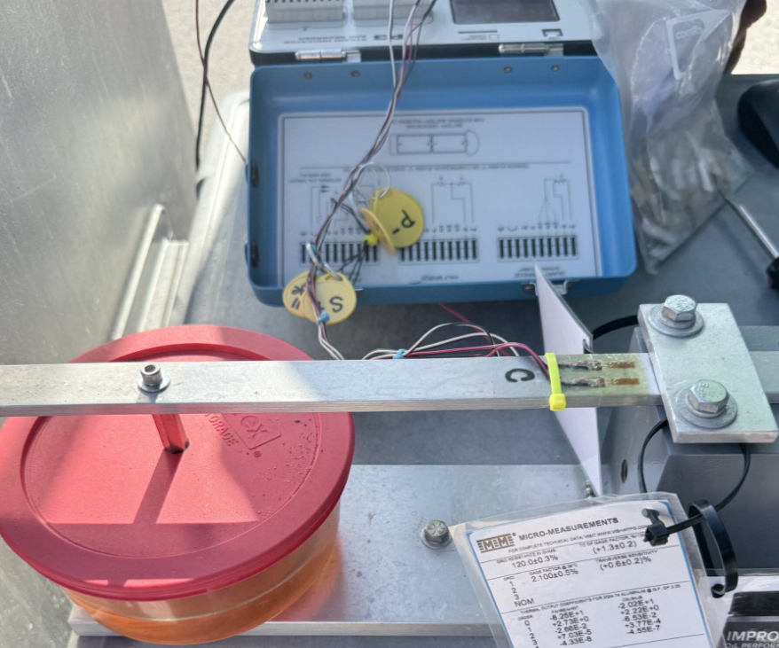
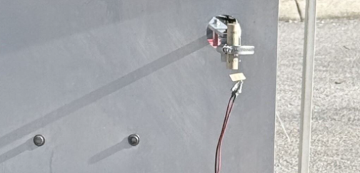
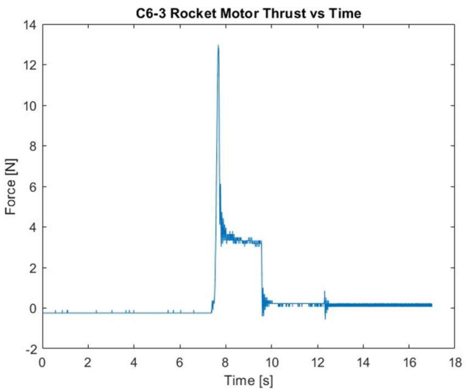

# Solid Rocket Motor Thrust Measurement    
**Institution:** Embry-Riddle Aeronautical University  
**Course:** AE 417 - Aerospace Structures & Instrumentation Lab  
**Dates:** November 2025  
**Equipment & Tools:** ESTES SRM Kit | Strain Gauge (Half-Bridge Configuration) | Analog-to-Digital Converter (ADC) | Cantilever Aluminum Beam | STP Oil (Damping Fluid)

---

## Experiment Overview  

The solid rocket motor experiment focused on measuring & analyzing the thrust produced by a small solid rocket motor using a calibrated load cell system. The primary objective was to characterize the thrust profile over time and compare experimental data to theoretical expectations.

Important output metrics we obtained throughout data collection & analysis included:
- Total thrust generated 
- Specific & total impulse   
- Digital voltage readings from the strain indicator  
- Thrust vs. time behavior  

By measuring thrust as a function of time, the experiment provided insight into the performance characteristics of solid rocket motors & the accuracy of experimental measurement techniques.

---

## Procedure & Results  

The experimental setup utilized a test stand equipped with a load cell to measure the force produced by a rocket motor during ignition and burn. Pictured below is the data collection setup utilizing strain gauges in half-bridge configurations, an ADC, damping fluid, and a beam mounted in a cantilever configuration. 

    
    
<em>Load cell data collection setup</em>

    
    
<em>ESTES SRM mounted to the thrust measurement stand</em>

The combination of instrumentation methods used in previous experiments allowed us to gather raw voltage data from the strain gauge readings & convert to thrust force based on the bending stress imparted upon the cantilever beam.

The general procedure for data collection & analysis consisted of:
- Mounting the rocket motor securely to the thrust measurement stand  
- Calibrating the load cell using known weights  
- Igniting the motor while recording voltage data over time  
- Converting sensor outputs into thrust values  
- Plotting thrust vs. time to analyze the burn profile of different SRMs

    
    
<em>C6-3 SRM thrust profile over time</em>

The resulting thrust curve displayed above shows a rapid rise in force immediately after ignition as the solid grain surface area increases to full exposure, followed by the average thrust region representing propellant expenditure, and a delay period after burnout lasting until the ejection charge activates. 

From this data, the following key performance parameters were obtained:

- Maximum thrust  
- Burn duration  
- Total impulse (area under the thrust curve)  

The experimental results aligned with expected trends in solid rocket motor thrust profiles; however, minor discrepancies were observed due to measurement noise, mounting alignment, and system calibration error.

---

## Valuable Takeaways  
This experiment utilized instrumentation & data collection methods from previous test setups to measure the thrust profile of small-scale solid rocket motors with different grain patterns.

Some of the key takeaways from the data collection & analysis portions of this lab are discussed below.

- **Understanding thrust profiles:** This lab reinforced how thrust varies over time rather than remaining constant, emphasizing the importance of transient analysis in propulsion systems.

- **Hands-on experience with instrumentation:** Working with load cells & calibration procedures highlighted the value of accurate data acquisition in testing environments.

- **Data interpretation & validation:** Comparing experimental thrust curves to theoretical expectations helped develop intuition for identifying errors and validating analytical results.

- **Real-world measurement limitations:** The experiment demonstrated how factors such as vibrations, sensor noise, and setup calibration can influence data quality, reinforcing the importance of error considerations.

Overall, this lab provided an insightful introduction to rocket propulsion testing & strengthened my ability to collect, process, and interpret dynamic experimental data.
