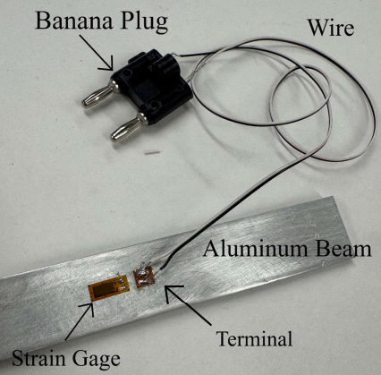
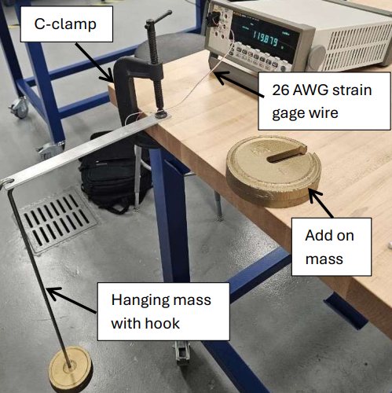

## Strain Gauge Installation & Beam Strain Measurment  
**Institution:** Embry-Riddle Aeronautical University  
**Course:** AE 417 - Aerospace Structures & Instrumentation Lab  
**Date:** September 2025  
**Equipment:** Strain Gauges, Digital Multimeter, Cantilever Beam Test Setup, Soldering Equipment

---

## Experiment Overview  

Strain gauges are widely used in engineering to measure surface strain in structural components. By bonding a thin conductive element to a material surface, very small changes in deformation can be detected through changes in electrical resistance.

The objective of this experiment was to learn how to properly install, wire, and utilize strain gauges to measure mechanical strain in a cantilever beam as it's subjected to bending loads. Once installed, the strain gauge's change in electrical resistance could be measured & converted into mechanical strain.

Two beam types were evaluated during the experiment:

- A 6061-T6511 aluminum alloy strip beam
- A Nomex honeycomb sandwich beam with Carbon-Fiber Reinforced Polymer (CFRP) facing skins

By applying known loads to each beam & measuring the resulting strain, the experiment demonstrated how strain gauges can be used to:

- Measure surface strain in bending structures
- Validate theoretical predictions from beam bending equations
- Estimate material properties, such as Young’s modulus for composite facing skins in sandwich structures.

---

## Procedure & Results  

The experiment began by preparing & installing a 120 Ω strain gauge onto the aluminum alloy beam, as seen below. Proper installation was critical to ensure accurate measurements & involved sensitive procedures such as:

- Cleaning & degreasing the beam surface
- Sanding the installation area to remove oxide layers from the aluminum
- Applying chemical conditioner & neutralizer
- Aligning the strain gauge parallel to the beam's longitudinal axis
- Bonding the gauge using a specialized adhesive
- Soldering lead wires & connecting a banana plug interface to measure electrical resistance

    
    
<em>Installed strain gauge on 6061-T6511 aluminum alloy strip beam</em>

Once installed, the strain gauge resistance was verified using a digital multimeter to confirm proper wiring and baseline resistance.

The beam was then mounted in a cantilever configuration using a C-clamp, with the strain gauge positioned near the fixed end where bending stress is highest. Known loads were applied to the free end using hanging masses in 1 kg increments up to 3 kg. 

The test setup to measure strain for the beam in compression is shown below.

    
    
<em>Cantilever beam setup to measure compressive strain</em>

Resistance measurements were recorded by the digital multimeter for both:

- Tension (gauge facing upward)
- Compression (beam inverted)

The same loading procedure was repeated for the Nomex honeycomb sandwich beam with a pre-installed strain gauge.

Using the measured resistance changes & the strain gauge factor, mechanical strain values were calculated with the aluminum beam producing a measured strain of approximately 886 microstrain under maximum load. This value differed from the theoretical prediction by less than 10%, validating the accuracy of the test apparatus.

For the sandwich beam, measured strain values were used to estimate Young’s modulus for the carbon fiber facing skins, resulting in a value of approximately 50 GPa, which is consistent with the expected properties of woven CFRP materials.

---

## Valuable Takeaways  

This laboratory experiment provided hands-on experience with structural instrumentation techniques used in aerospace testing & structural health monitoring.

Key takeaways from the experiment include:

- Learning the precision required for proper strain gauge installation, including surface preparation, bonding, and soldering
- Understanding how strain gauges convert mechanical deformation into measurable electrical resistance signals
- Applying beam bending theory to predict strain & validate experimental measurements
- Using measured strain data to estimate material properties, such as Young’s modulus
- Observing the structural efficiency of sandwich composite beams, where thin high-strength skins carry most of the bending load while the lightweight core maintains structural separation

Overall, the experiment demonstrated how strain gauges serve as a powerful tool for measuring structural properties, validating analytical models, and evaluating material behavior in aerospace structures.
