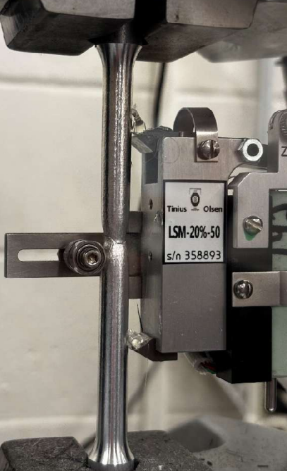
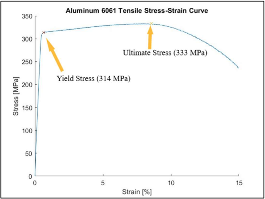
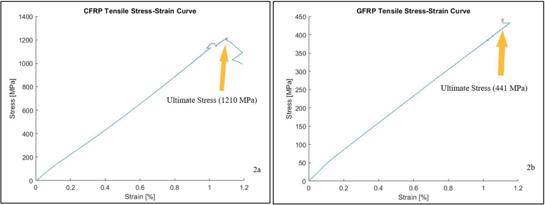
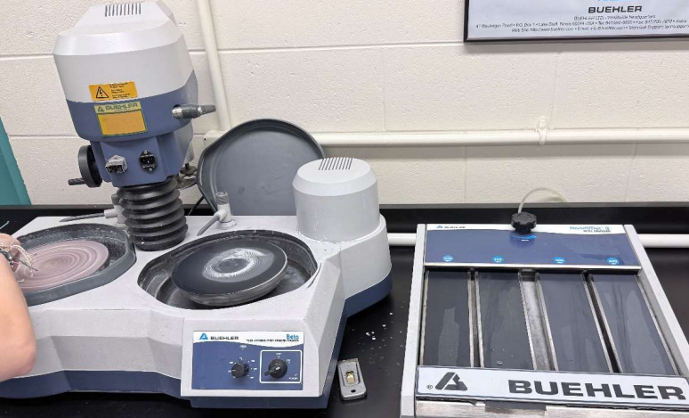
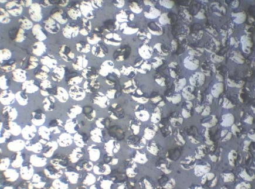

# Aluminum & Composite Tensile Testing  
**Institution:** Embry-Riddle Aeronautical University  
**Dates:** September 2025  
**Course:** AE 417 - Aerospace Structures & Instrumentation Lab  
**Equipment & Tools:** Universal Testing Machine (UTM), Aluminum & Composite Tensile Specimen, LVDT Extensometer

---

## Experiment Overview  

This experiment investigated the tensile behavior of aerospace structural materials, specifically aluminum alloys & fiber-reinforced polymer composites. Tensile testing is one of the most fundamental methods for evaluating mechanical properties such as Young’s modulus, yield strength, ultimate tensile strength, and ductility.

The objective of the lab was to compare the mechanical response of ductile metallic materials with brittle composite materials under axial loading. 6061-T651 aluminum alloy, glass fiber-reinforced polymer (GFRP), and carbon fiber-reinforced polymer (CFRP) samples were tested using a universal testing machine equipped with a Linear Variable Differential Transformer (LVDT) extensometer to measure strain during loading.

In addition to mechanical testing, the lab utilized metallographic preparation & an optical microscope to examine the microstructure of composite materials. This provided insight into how fiber architecture & matrix bonding properties influence material strength & stiffness.

---

## Procedure & Results  

The experiment conducted tensile tests for three specimen types:

- 6061-T651 Aluminum alloy  
- Glass fiber-reinforced polymer (GFRP)  
- Carbon fiber-reinforced polymer (CFRP) 

The dimensions of each specimen were measured using calipers to determine the cross-sectional area for each rod, while composite specimens were also weighed to evaluate weight-specific performance. Each sample was then mounted in a Tinius Olsen (UTM), where tensile loads were applied until failure while recording stress–strain data.

An LVDT extensometer was attached to the specimen gauge section to accurately measure strain during the elastic deformation phase of the tensile test, as seen below. The aluminum sample was tested at higher loading rates than the composite rods due to its increased ductility.

    
    
<em>Tensile test setup for aluminum alloy sample with LVDT extensometer</em>

The force and displacement data for each specimen were collected using a data-acquisition setup & converted into engineering stress–strain curves, allowing for the determination of key mechanical properties such as:

- Young’s modulus  
- Yield strength (aluminum alloy only)  
- Ultimate tensile strength  
- Failure strain & ductility  

    
    
<em>Stress-strain curve for aluminum alloy specimen</em>

    
    
<em>Stress-strain curves for composite samples</em>

The tensile test behavior for each sample can be observed in the plots shown above & summarized as follows:

- **Aluminum alloys:** exhibited ductile behavior with noticeable plastic deformation & yielding before fracture.  
- **GFRP:** showed relatively linear elastic behavior followed by sudden brittle failure.  
- **CFRP:** demonstrated high stiffness & strength with limited plastic deformation before fracture.

Following the tensile tests, a CFRP sample was prepared using progressively finer silicon carbide sandpapers & polished using an alumina slurry to produce a mirror-like surface. The polished sample was then examined using a metallurgical optical microscope, allowing for the observation of fiber orientation & matrix distribution within the composite. 

The polishing station & a microscopic 100x zoom view of the CFRP sample are pictured below.

  
  

    
    
<em>Metallography CFRP polishing station</em>

  

  

    
    
<em>Metallography 100x microscopic fiber/matrix properties</em>

  

---

## Valuable Takeaways  

This lab reinforced several important concepts in aerospace materials & structural mechanics.

First, the experiment demonstrated the clear mechanical differences between metals & fiber-reinforced composites. Aluminum alloys exhibited ductile behavior with significant plastic deformation, while composite materials behaved in a more brittle manner until failure.

The lab also highlighted the importance of weight-specific performance in aerospace design. Although composites may exhibit brittle failure characteristics, their high strength-to-weight & stiffness-to-weight ratios make them extremely valuable for aircraft & spacecraft structural applications.

The experiment gave me additional experience operating a universal testing machine with an LVDT extensometer, tools commonly used in structural testing & materials experimentation.

Finally, the metallography portion of the lab emphasized how microstructural features such as fiber alignment, matrix fractions, and defects directly influence macroscopic mechanical properties.

Overall, this lab provided valuable exposure to the experimental characterization of structural materials, linking theoretical material behavior to real-world engineering measurements.
