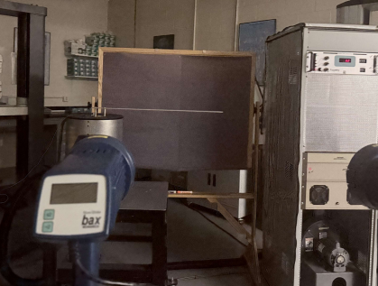
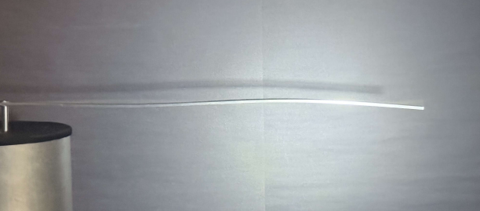
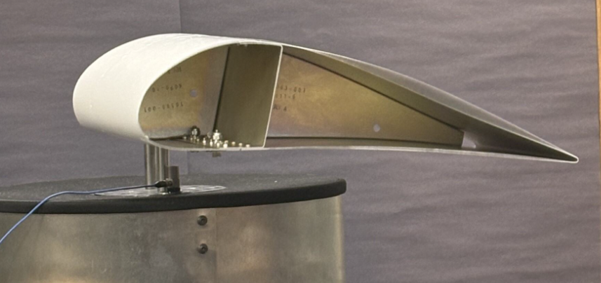

## Vibrations & Resonance in Aerospace Structures  
**Institution:** Embry-Riddle Aeronautical University  
**Course:** AE 417 - Aerospace Structures & Instrumentation Lab  
**Dates:** October 2025  
**Equipment & Tools:** Digital Oscilloscope, Electrodynamic Shaker, Sweep Sine Generator, Digital Stroboscope

---

## Experiment Overview  

The vibrations & resonance experiment investigated the dynamic response of structures subjected to forced vibration, with a focus on identifying natural frequencies, mode shapes, and nodal locations. Aluminum cantilever beams of varying lengths, as well as an airfoil, were excited using an electrodynamic shaker to induce resonance conditions.

Implementing a digital stroboscope at the same frequency as the electrodynamic shaker vibration allowed us to observe the mode behavior of different structures in detail.

The primary objective was to compare experimentally measured resonance frequencies & node positions with theoretical predictions derived from beam theory. Additional emphasis was placed on understanding how resonance can lead to large structural displacements & potential failure, even under loads with relatively small magnitude.

---

## Procedure & Results  

The test setup pictured below utilized an electrodynamic shaker, accelerometer, oscilloscope, and digital stroboscope to excite and measure beam vibrations. Each component was fixed to the electrodynamic shaker at one end & subjected to controlled sinusoidal loading across a range of frequencies.  

    
    
<em>Experimental setup to observe dynamic behavior</em>

Resonance was identified by observing the maximum amplitude response, while corresponding frequencies were recorded using multiple instruments for redundancy. A digital stroboscope was used to visually “freeze” the motion of the beam, allowing for clear identification & measurement of nodal positions as seen below. 

    
    
<em>Mode 3 vibrational beam response</em>

The airfoil shown below wasn't used to conduct any data analysis; however, it provided a qualitative understanding & visual representation of how sinusoidal loads can affect aerospace structures.

    
    
<em>Airfoil sample subjected to forced oscillatory loading</em>

Some of the key results from the experiment included:

- Identification of vibration modes for both short & long aluminum beams  
- Experimental calculation of natural frequencies within 10% of theoretical predictions, validating analytical model accuracy
- Nodal position measurements within  3% of expected values
- Strong agreement between measurement instruments (sine generator/oscilloscope/strobscope), with discrepancies within 5% of one another

The data analysis also demonstrated that lower-frequency modes exhibited higher relative error. This was due to more ambiguity in the node locations exhibited by the dynamic response at lower frequencies.

---

## Valuable Takeaways  

This lab reinforced the importance of conducting vibrational analysis in aerospace structures before qualifying them for flight. The experiment particularly emphasized the need to avoid resonance conditions that can lead to catastrophic failure.  

The most relevant takeaways & learning points I took from the experiment were that:

- Resonance can induce significant dynamic responses in structures even under small magnitude inputs, making it a critical design consideration  
- Mode shapes and nodal behavior provide valuable insight into how structures deform under sinusoidal loading
- Experimental validation is essential for confirming analytical models of dynamic systems  
- Utilizing multiple measurement techniques for the same test improves confidence in collected results & helps identify instrument bias  

Overall, this experiment provided great hands-on experience with vibrational testing equipment & highlighted the importance of considering oscillatory loading for ensuring the safety & reliability of aerospace systems.
